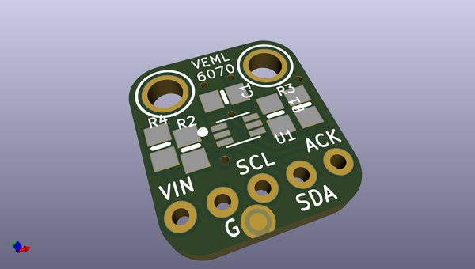
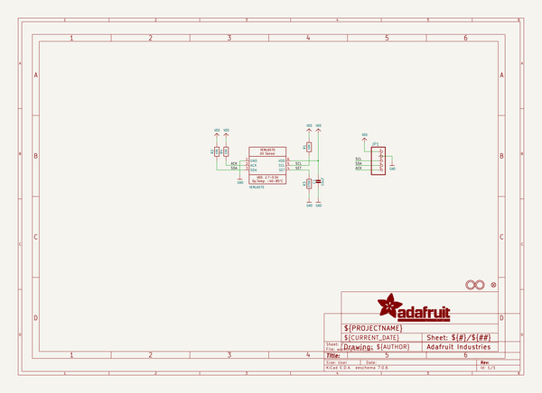
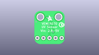
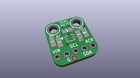
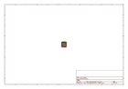
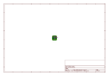
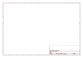
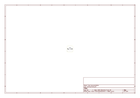

# OOMP Project  
## Adafruit-VEML6070-PCB  by adafruit  
  
oomp key: oomp_projects_flat_adafruit_adafruit_veml6070_pcb  
(snippet of original readme)  
  
-- Adafruit VEML6070 Sensor PCB  
<a href="http://www.adafruit.com/products/2899">   
Click here to purchase one from the Adafruit shop</a>  
  
This little sensor is a great way to add UV light sensing to any microcontroller project. The VEML6070 from Vishay has a true UV A light sensor and an I2C-controlled ADC that will take readings and integrate them for you over ~60ms to 500ms.  
  
Please note, for UV sensing we now recommend the VEML6075 which is an improved version of this sensor with both UVA and UVB sensors and UV Index calculations  
  
Unlike the Si1145, this sensor will not give you UV Index readings. However, the Si1145 does UV Index approximations based on light level not true UV sensing. The VEML6070 in contrast does have a real light sensor in the UV spectrum. It's also got a much much simpler I2C interface so you can run it on the smallest microcontrollers with ease. Unlike the GUVA analog sensor, the biasing and ADC is all internal so you don't need an ADC.  
  
This UV sensor works great with 3 or 5V power or logic, its nice and compact, and its easy to use with any I2C-capable microcontroller. Each order comes with one assembled PCB with a sensor, some handy pullup resistors, a 270K rset resistor and a small piece of header. Some light soldering is required to attach the header but its a fast task!  
  
PCB files for Adafruit VEML6070 sensor breakout. The format is EagleCAD schematic and board layout  
- https://www.adafruit.  
  full source readme at [readme_src.md](readme_src.md)  
  
source repo at: [https://github.com/adafruit/Adafruit-VEML6070-PCB](https://github.com/adafruit/Adafruit-VEML6070-PCB)  
## Board  
  
  
## Schematic  
  
  
  
[schematic pdf](working_schematic.pdf)  
## Images  
  
  
  
  
  
  
  
  
  
  
  
  
  
  
  
  
