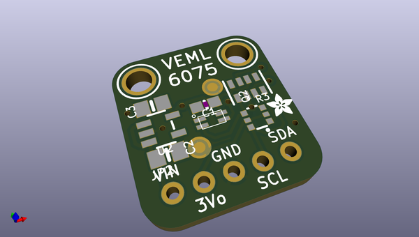
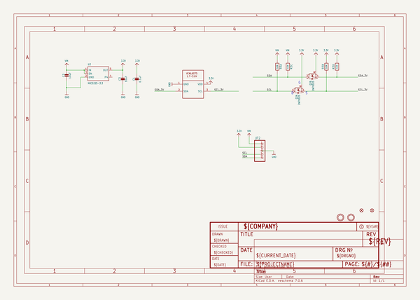
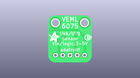
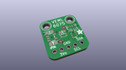
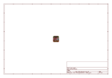
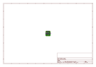
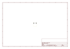
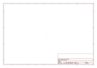
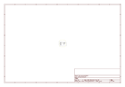

# OOMP Project  
## Adafruit-VEML6075-UV-Sensor-PCB  by adafruit  
  
oomp key: oomp_projects_flat_adafruit_adafruit_veml6075_uv_sensor_pcb  
(snippet of original readme)  
  
-- Adafruit VEML6075 UVA UVB and UV Index Sensor Breakout PCB  
  
<a href="http://www.adafruit.com/products/3964">   
Click here to purchase one from the Adafruit shop</a>  
  
PCB files for the Adafruit VEML6075 UVA UVB and UV Index Sensor Breakout. Format is EagleCAD schematic and board layout  
* https://www.adafruit.com/product/3964  
  
--- Description  
  
This little sensor is a great way to add UVA and UVB light sensing to any microcontroller project. The VEML6075 from Vishay has both true UVA and UVB band light sensors and an I2C-controlled ADC that will take readings and integrate them. The sensor also comes with calibration registers so you can easily convert the UVA/UVB readings into the UV Index.  
  
Compared to our other UV sensors, this one actually does a pretty good job of getting accurate UV data. Unlike the Si1145, it has a real UV sensor, and in contrast to the VEML6070, it has dual band senors and an Index calculation algorithm. So far this is the best UV sensor we've got!  
  
This UV sensor works great with 3 or 5V power or logic, its nice and compact, and its easy to use with any I2C-capable microcontroller. We have [example code and libraries for Arduino](https://github.com/adafruit/Adafruit_VEML6075) and [CircuitPython/Python](https://github.com/adafruit/Adafruit_CircuitPython_VEML6075).  
  
Each order comes with one assembled PCB with a sensor, power regulator, level shifting and a small piece of header. Some light soldering  
  full source readme at [readme_src.md](readme_src.md)  
  
source repo at: [https://github.com/adafruit/Adafruit-VEML6075-UV-Sensor-PCB](https://github.com/adafruit/Adafruit-VEML6075-UV-Sensor-PCB)  
## Board  
  
  
## Schematic  
  
  
  
[schematic pdf](working_schematic.pdf)  
## Images  
  
  
  
  
  
  
  
  
  
  
  
  
  
  
  
  
