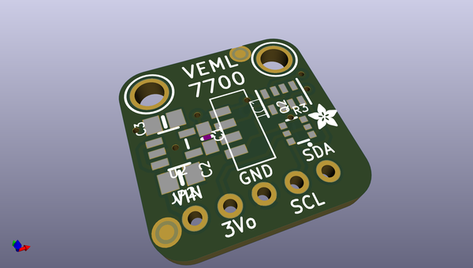
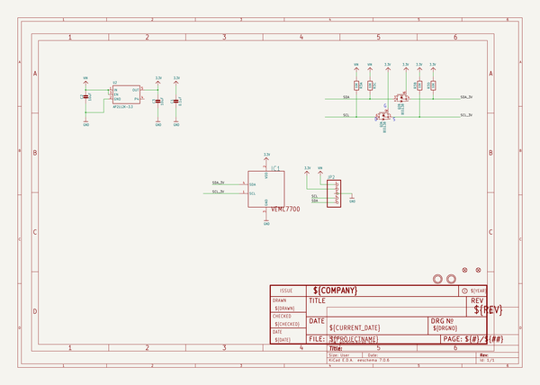

# OOMP Project  
## Adafruit-VEML7700-PCB  by adafruit  
  
oomp key: oomp_projects_flat_adafruit_adafruit_veml7700_pcb  
(snippet of original readme)  
  
-- Adafruit VEML7700 Lux Sensor PCB  
  
  
<a href="http://www.adafruit.com/products/5378">   
Click here to purchase the right-angle STEMMA QT version from the Adafruit shop</a>  
<a href="http://www.adafruit.com/products/4162">   
Click here to purchase the original version from the Adafruit shop</a>  
  
PCB files for the Adafruit VEML7700 Lux Sensor. Format is EagleCAD schematic and board layout  
* https://www.adafruit.com/product/4162  
  
--- Description  
  
Vishay has a lot of light sensors out there, and this is a nice simple lux sensor that's easy to add to any microcontoller. Most light sensors just give you a number for brighter/darker ambient lighting. The VEML7700 makes your life easier by calculating the lux, which is an SI unit for light. You'll get more consistent readings between multiple sensors because you aren't dealing with some unit-less values.  
  
The sensor has 16-bit dynamic range for ambient light detection from 0 lux to about 120 klux with resolution down to 0.0036 lx/ct, with software-adjustable gain and integration times.  
  
Interfacing is easy - this sensor uses plain, universal I2C. We put this sensor on a breakout board with a 3.3V regulator and logic level shifter so you can use it with 3.3V or 5V power/logic microcontrollers. [We have written libraries for Arduino (C/C++)](https://github.com/adafruit/Adafruit_VEML7700) as well as [CircuitPython (Python 3)]https:/  
  full source readme at [readme_src.md](readme_src.md)  
  
source repo at: [https://github.com/adafruit/Adafruit-VEML7700-PCB](https://github.com/adafruit/Adafruit-VEML7700-PCB)  
## Board  
  
  
## Schematic  
  
  
  
[schematic pdf](working_schematic.pdf)  
## Images  
  
  
  
  
  
  
  
  
  
  
  
  
  
  
  
  
