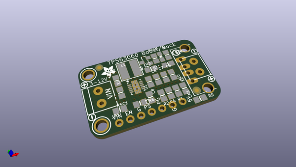
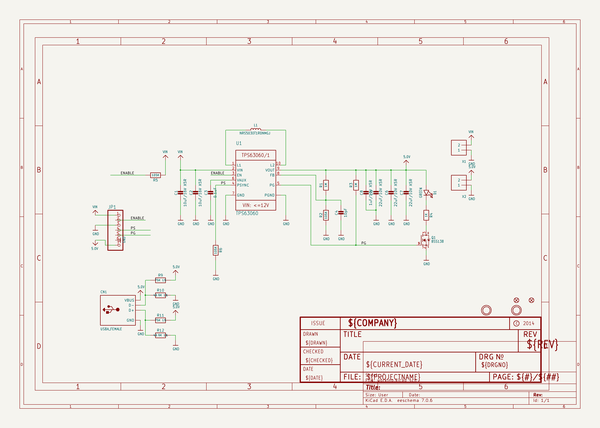
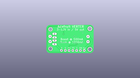
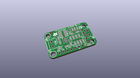
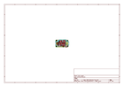
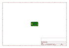
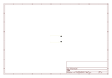
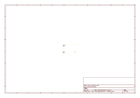
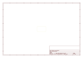
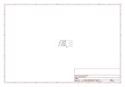

# OOMP Project  
## Adafruit-Verter-PCB  by adafruit  
  
oomp key: oomp_projects_flat_adafruit_adafruit_verter_pcb  
(snippet of original readme)  
  
-- Adafruit Verter Buck/Boost Breakout PCB  
<a href="http://www.adafruit.com/products/2190">   
Click here to purchase one from the Adafruit shop</a>  
  
Convert just about any battery pack to 5V with VERTER - our fresh new Buck-Boost power converter. VERTER can take battery voltages from 3-12VDC and output a nice 5V DC, which makes it a perfect universal power supply for your portable project! Where Verter really shines is when you have a battery or power range that can fluctuate a lot, or you don't know what you'll end up using.  
  
It operates smoothly over the 3-12V range, moving from a boost converter (3-5V in) to a buck converter (5-12V in) on the fly. Please note! This chip can do both, but it really works better as a buck converter than a boost. If you need a full 500mA out, it will struggle as it gets down to 3V and the output will sag to about 4.8V (which is still within standard USB power specs). If you only need something to boost a voltage up to 5V and you want it to be really good at it, check out our PowerBoost series, which excel at that.  
  
Like our popular 5V 1A USB wall adapter, we tweaked the output to be 5.2V instead of a straight-up 5.0V so that there's a little bit of 'headroom' long cables, high draw, the addition of a diode on the output if you wish, etc. The 5.2V is safe for all 5V-powered electronics like Arduino, Raspberry Pi, or Beagle Bone while preventing icky brown-outs during high current draw becaus  
  full source readme at [readme_src.md](readme_src.md)  
  
source repo at: [https://github.com/adafruit/Adafruit-Verter-PCB](https://github.com/adafruit/Adafruit-Verter-PCB)  
## Board  
  
  
## Schematic  
  
  
  
[schematic pdf](working_schematic.pdf)  
## Images  
  
  
  
  
  
  
  
  
  
  
  
  
  
  
  
  
