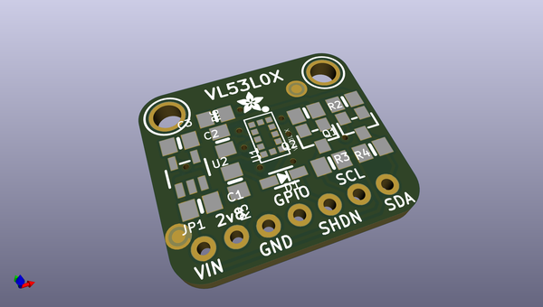
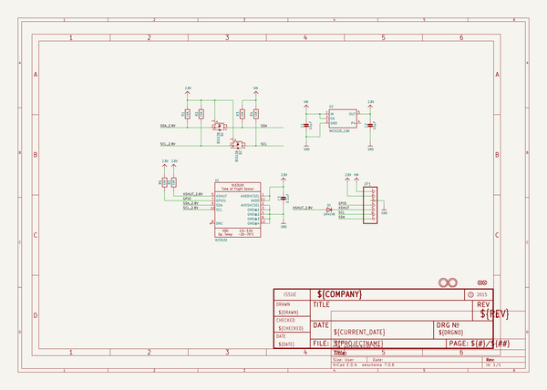

# OOMP Project  
## Adafruit-VL53L0X-ToF-Distance-Sensor-PCB  by adafruit  
  
(snippet of original readme)  
  
- PCB files for the Adafruit VL53L0X ToF Distance Sensor  
  
<a href="http://www.adafruit.com/products/3317"> </a>  
<a href="http://www.adafruit.com/products/3317"> Click here to purchase one from the Adafruit shop</a>  
  
__Format is EagleCAD schematic and board layout__  
  
The __VL53L0X__ is a *Time of Flight* distance sensor like no other you've used! The sensor contains a very tiny invisible laser source, and a matching sensor. The VL53L0X can detect the "time of flight", or how long the light has taken to bounce back to the sensor. Since it uses a very narrow light source, it is good for determining distance of only the surface directly in front of it. Unlike sonars that bounce ultrasonic waves, the 'cone' of sensing is very narrow. Unlike IR distance sensors that try to measure the amount of light bounced, the VL53L0x is much more precise and doesn't have linearity problems or 'double imaging' where you can't tell if an object is very far or very close.  
  
This is the 'big sister' of the [VL6180X ToF sensor](https://www.adafruit.com/products/3316), and can handle about 50mm to 1200mm of range distance. If you need a smaller/closer range, check out the VL6180X which can measure 5mm to 200mm and also contains a light sensor.  
  
The sensor is small and easy to use in any robotics or interactive project. Since it needs 2.8V power and logic we put the little fellow on a breakout b  
  full source readme at [readme_src.md](readme_src.md)  
  
source repo at: [https://github.com/adafruit/Adafruit-VL53L0X-ToF-Distance-Sensor-PCB](https://github.com/adafruit/Adafruit-VL53L0X-ToF-Distance-Sensor-PCB)  
## Board  
  
  
## Schematic  
  
  
  
[schematic pdf](working_schematic.pdf)  
## Images  
  
  
  
  
  
  
  
  
  
  
  
  
  
  
  
  
