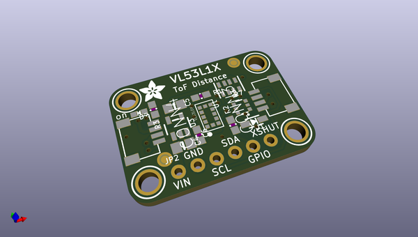
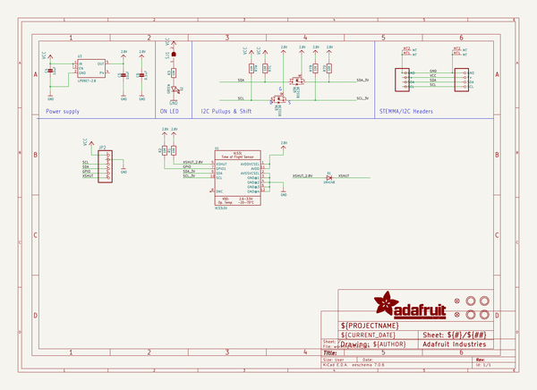
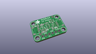
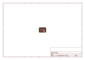
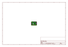

# OOMP Project  
## Adafruit-VL53L1X-PCB  by adafruit  
  
(snippet of original readme)  
  
-- Adafruit VL53L1X Time of Flight Distance Sensor PCB  
  
<a href="http://www.adafruit.com/products/3967">   
Click here to purchase one from the Adafruit shop</a>  
  
PCB files for the Adafruit VL53L1X Time of Flight Distance Sensor.   
  
Format is EagleCAD schematic and board layout  
* https://www.adafruit.com/product/3967  
  
--- Description  
  
The Adafruit VL53L1X Time of Flight Distance Sensor (also known as VL53L1CX) is a Time of Flight distance sensor that has a massive 4 meter range and LIDAR-like precision. The sensor contains a very tiny invisible laser source and a matching sensor. The VL53L1X can detect the "time of flight", or how long the light has taken to bounce back to the sensor.  
  
Since it uses a very narrow light source, it is good for determining the distance of only the surface directly in front of it. Unlike sonars that bounce ultrasonic waves, the 'cone' of sensing is very narrow. Unlike IR distance sensors that try to measure the amount of light bounced, the VL53L1X is much more precise and doesn't have linearity problems or 'double imaging' where you can't tell if an object is very far or very close.  
  
This is the 'next generation' of the VL53L0X ToF sensor and can handle about ~30 to 4000mm of range distance, with up to 50Hz update rate. If you need an even smaller/closer range, check out the VL6180X which can measure 5mm to 200mm and also contains a light sensor.  
  
The sensor is small and easy to use in any roboti  
  full source readme at [readme_src.md](readme_src.md)  
  
source repo at: [https://github.com/adafruit/Adafruit-VL53L1X-PCB](https://github.com/adafruit/Adafruit-VL53L1X-PCB)  
## Board  
  
  
## Schematic  
  
  
  
[schematic pdf](working_schematic.pdf)  
## Images  
  
  
  
  
  
  
  
  
  
  
  
  
  
  
  
  
