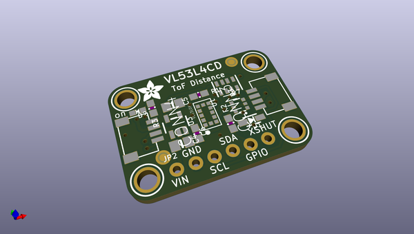
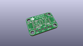
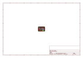
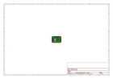
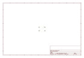
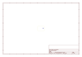
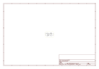

# OOMP Project  
## Adafruit-VL53L4CD-PCB  by adafruit  
  
oomp key: oomp_projects_flat_adafruit_adafruit_vl53l4cd_pcb  
(snippet of original readme)  
  
-- Adafruit VL53L4CD Time of Flight Distance Sensor PCB  
  
<a href="http://www.adafruit.com/products/5396">   
Click here to purchase one from the Adafruit shop</a>  
  
PCB files for the Adafruit VL53L4CD Time of Flight Distance Sensor.   
  
Format is EagleCAD schematic and board layout  
* https://www.adafruit.com/product/5396  
  
--- Description  
  
The Adafruit VL53L4CD Time of Flight Sensor is another great Time of Flight distance sensor from ST in the VL5 series of chips, this one is great for shorter distances. The sensor contains a very tiny invisible laser source and a matching sensor. The VL53L4CD can detect the "time of flight", or how long the light has taken to bounce back to the sensor. Since it uses a very narrow light source, it is good for determining distance of only the surface directly in front of it. Unlike sonars that bounce ultrasonic waves, the 'cone' of sensing is very narrow. Unlike IR distance sensors that try to measure the amount of light bounced, the VL53 is much more precise and doesn't have linearity problems or 'double imaging' where you can't tell if an object is very far or very close.  
  
This is another 'big sister' of the VL6180X ToF sensor and can handle about ~1 to 1300mm of range distance: basically it combines the short range of the VL6180X in that it can sense up to the body of the sensor, with the increased range of the VL53L0X, which can handle about 50mm to 1200mm of range distance.  
  
The sensor i  
  full source readme at [readme_src.md](readme_src.md)  
  
source repo at: [https://github.com/adafruit/Adafruit-VL53L4CD-PCB](https://github.com/adafruit/Adafruit-VL53L4CD-PCB)  
## Board  
  
  
## Schematic  
  
  
  
[schematic pdf](working_schematic.pdf)  
## Images  
  
  
  
  
  
  
  
  
  
  
  
  
  
  
  
  
