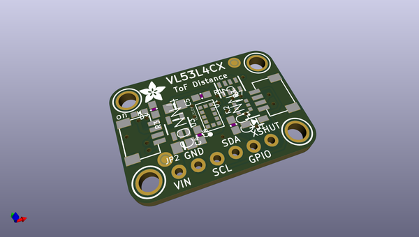
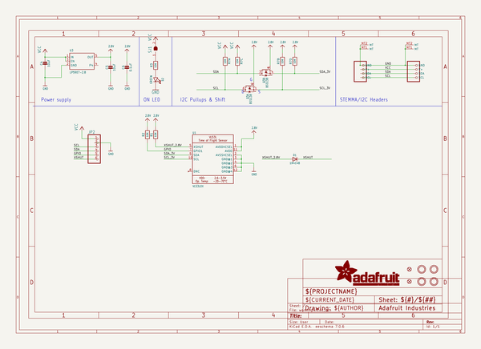

# OOMP Project  
## Adafruit-VL53L4CX-PCB  by adafruit  
  
oomp key: oomp_projects_flat_adafruit_adafruit_vl53l4cx_pcb  
(snippet of original readme)  
  
-- Adafruit VL53L4CX Time of Flight Distance Sensor PCB  
  
<a href="http://www.adafruit.com/products/5425">   
Click here to purchase one from the Adafruit shop</a>  
  
PCB files for the Adafruit VL53L4CX Time of Flight Distance Sensor.   
  
Format is EagleCAD schematic and board layout  
* https://www.adafruit.com/product/5425  
  
--- Description  
  
The Adafruit VL53L4CX Time of Flight Sensor is another great Time of Flight distance sensor from ST in the VL5 series of chips, this one is great for long distances - it goes up to 6 meters compared with 4 meter max of the VL53L1X.  
  
The sensor contains a very tiny invisible laser source and a matching sensor. The VL53L4CX can detect the "time of flight", or how long the light has taken to bounce back to the sensor. Since it uses a very narrow light source, it is good for determining distance of only the surface directly in front of it. Unlike sonars that bounce ultrasonic waves, the 'cone' of sensing is very narrow. Unlike IR distance sensors that try to measure the amount of light bounced, the VL53 is much more precise and doesn't have linearity problems or 'double imaging' where you can't tell if an object is very far or very close.  
  
This is a 'big sister' of the VL53L4CD ToF sensor and can handle about ~1 to 6000mm of range distance, it also has some ability to do 'multi object detection'. Basically it can identify when more than one object is in view and tell you the two distances.  
  
Please  
  full source readme at [readme_src.md](readme_src.md)  
  
source repo at: [https://github.com/adafruit/Adafruit-VL53L4CX-PCB](https://github.com/adafruit/Adafruit-VL53L4CX-PCB)  
## Board  
  
  
## Schematic  
  
  
  
[schematic pdf](working_schematic.pdf)  
## Images  
  
  
  
  
  
  
  
  
  
  
  
  
  
  
  
  
