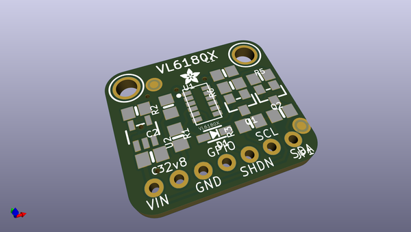
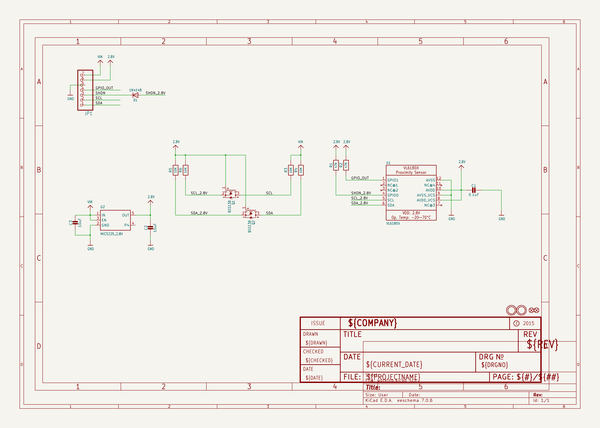

# OOMP Project  
## Adafruit-VL6180X-ToF-Distance-Sensor-PCB  by adafruit  
  
(snippet of original readme)  
  
-- Adafruit VL6180X ToF Distance Sensor PCB  
  
<a href="http://www.adafruit.com/products/3316">   
Click here to purchase one from the Adafruit shop</a>  
  
PCB files for the Adafruit VL6180X (VL6180) ToF Distance Sensor. Format is EagleCAD schematic and board layout  
  
For more details, check out the product page at  
* https://www.adafruit.com/product/3316  
  
--- Description  
  
The VL6180X (sometimes called the VL6180) is a Time of Flight distance sensor like no other you've used! The sensor contains a very tiny laser source, and a matching sensor. The VL6180X can detect the "time of flight", or how long the laser light has taken to bounce back to the sensor. Since it uses a very narrow light source, it is good for determining distance of only the surface directly in front of it.  
  
Unlike sonars that bounce ultrasonic waves, the 'cone' of sensing is very narrow. Unlike IR distance sensors that try to measure the amount of light bounced, the VL6180X is much more precise and doesn't have linearity problems or 'double imaging' where you can't tell if an object is very far or very close.  
  
This is the 'little sister' of the Adafruit VL53L0X ToF sensor, and can handle about 5mm to 100mm of range distance. We've seen up to 150-200mm with good ambient conditions. It also includes a lux sensor. If you need a larger range, check out the VL53L0X which can measure 50 - 1200 mm.  
  
The sensor is small and easy to use in any robotics or interactive pr  
  full source readme at [readme_src.md](readme_src.md)  
  
source repo at: [https://github.com/adafruit/Adafruit-VL6180X-ToF-Distance-Sensor-PCB](https://github.com/adafruit/Adafruit-VL6180X-ToF-Distance-Sensor-PCB)  
## Board  
  
  
## Schematic  
  
  
  
[schematic pdf](working_schematic.pdf)  
## Images  
  
  
  
  
  
  
  
  
  
  
  
  
  
  
  
  
