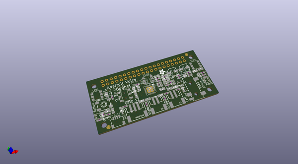

# OOMP Project  
## Adafruit-Voice-Bonnet-PCB  by adafruit  
  
oomp key: oomp_projects_flat_adafruit_adafruit_voice_bonnet_pcb  
(snippet of original readme)  
  
-- Adafruit Voice Bonnet PCB  
  
<a href="http://www.adafruit.com/products/4757">   
Click here to purchase one from the Adafruit shop</a>  
  
PCB files for the Adafruit Voice Bonnet.  
  
Format is EagleCAD schematic and board layout  
* https://www.adafruit.com/product/4757  
  
--- Description  
  
Your Raspberry Pi computer is like an electronic brain - and with the Adafruit Voice Bonnet you can give it a mouth and ears as well! Featuring two microphones and two 1 Watt speaker outputs using a high quality I2S codec, this Pi add-on will work with any Raspberry Pi with a 2x20 connector - from the Pi Zero up to the Pi 4 and beyond (basically all but the very first ones made).  
  
The on-board WM8960 codec uses I2S digital audio for great quality recording and playback - so it sounds a lot better than the headphone jack on the Pi (or the no-headphone jack on a Pi Zero). We put ferrite beads and filter capacitors on every input and output to get the best possible performance, and all at a great price.  
  
We specifically designed this bonnet for use with making machine learning projects such as DIY voice assistants - for example see this guide on creating a DIY Google Assistant. But you could do various voice activated or voice recognition projects. With two microphones, basic voice position can be detected as well.  
  
* WM8960 codec uses I2S digital audio for both input and output  
* On/Off privacy switch to deactivate audio so you know it can't be reco  
  full source readme at [readme_src.md](readme_src.md)  
  
source repo at: [https://github.com/adafruit/Adafruit-Voice-Bonnet-PCB](https://github.com/adafruit/Adafruit-Voice-Bonnet-PCB)  
## Board  
  
  
## Schematic  
  
  
  
[schematic pdf](working_schematic.pdf)  
## Images  
