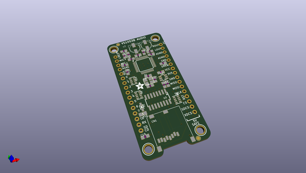
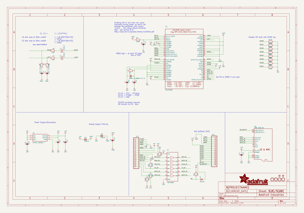
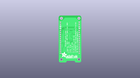
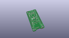
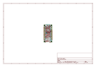
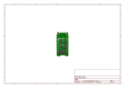
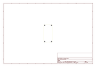
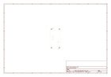
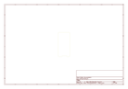
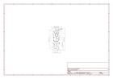

# OOMP Project  
## Adafruit-VS1053-Breakout-PCB  by adafruit  
  
oomp key: oomp_projects_flat_adafruit_adafruit_vs1053_breakout_pcb  
(snippet of original readme)  
  
-- Adafruit VS1053 Music Breakout PCB  
<a href="http://www.adafruit.com/products/1381">   
Click here to purchase one from the Adafruit shop</a>  
  
This breakout board is the ultimate companion for the VLSI VS1053B DSP codec chip. The VS1053 can decode a wide variety of audio formats such as MP3, AAC, Ogg Vorbis, WMA, MIDI, FLAC, WAV (PCM and ADPCM). It can also be used to record audio in both PCM (WAV) and compressed Ogg Vorbis. You can do all sorts of stuff with the audio as well such as adjusting bass, treble, and volume digitally. There is also 8 GPIO pins that can be used for stuff like lighting up small LEDs or reading buttons.  
  
All this functionality is implemented in a light-weight SPI interface so nearly any microcontroller can play audio from an SD card. There's also a special MIDI mode that you can boot the chip into that will read 'classic' 31250Kbaud MIDI data on a UART pin and act like a synth/drum machine - there are dozens of built-in drum and sample effects! But the chip is a pain to solder, and needs a lot of extras. That's why we spun up the best breakout, perfect for use with an Arduino but also good for other microcontrollers that just don't have the computational power to decode MP3s.  
  
This is the PCB for the Adafruit VS1053 (MP3/MIDI/WAV/Ogg...) Breakout board. The format is EagleCAD schematic and board layout  
- https://www.adafruit.com/product/1381  
  
--- License  
  
Adafruit invests time and resources provi  
  full source readme at [readme_src.md](readme_src.md)  
  
source repo at: [https://github.com/adafruit/Adafruit-VS1053-Breakout-PCB](https://github.com/adafruit/Adafruit-VS1053-Breakout-PCB)  
## Board  
  
  
## Schematic  
  
  
  
[schematic pdf](working_schematic.pdf)  
## Images  
  
  
  
  
  
  
  
  
  
  
  
  
  
  
  
  
