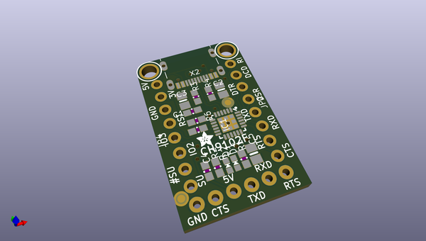
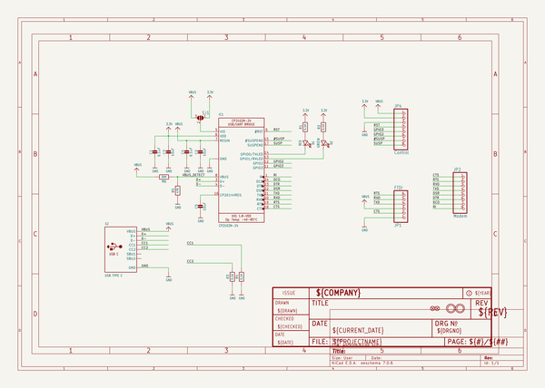
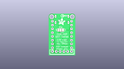
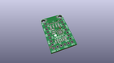
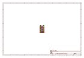
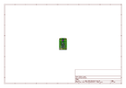
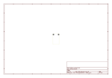
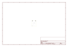
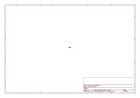
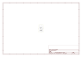

# OOMP Project  
## Adafruit-WCH-CH9102F-Friend-PCB  by adafruit  
  
oomp key: oomp_projects_flat_adafruit_adafruit_wch_ch9102f_friend_pcb  
(snippet of original readme)  
  
-- Adafruit WCH CH9102F Friend - USB to Serial Converter PCB  
  
<a href="http://www.adafruit.com/products/5568">   
Click here to purchase one from the Adafruit shop</a>  
  
PCB files for the Adafruit WCH CH9102F Friend - USB to Serial Converter.   
  
Format is EagleCAD schematic and board layout  
* https://www.adafruit.com/product/5568  
  
--- Description  
  
Long gone are the days of parallel ports and serial ports. Now the USB port reigns supreme! But USB is hard, and you just want to transfer your everyday serial data from a microcontroller to computer. What now? Enter the Adafruit CH9102F Friend, a version of our popular USB-Serial 'friend' breakouts that uses the affordable (and available) CH9102F - a 'near pin-compatible' to the CP2102N.  
  
This board features the CH9102F USB-Serial chip that can upload code at  3Mbit/s for fast development time. It also has auto-reset for Arduino/ATmega328 boards so no noodling with pins and reset button pressings. The CH9102F has fairly good driver support, and for 99% of use cases is a fine replacement of the FTR232, FT231x or CP210x series. With a modern USB Type C connector, it's ready to rock on any kind of computer.  
  
Some things we've noted as we have been working with this board:  
  
The RX LED blinks as you expect when data is received, however the TX LED does not blink constantly. Instead after a few seconds of data transmission the LED will blink slowly.  
On Linux, the CTS pin is not supported   
  full source readme at [readme_src.md](readme_src.md)  
  
source repo at: [https://github.com/adafruit/Adafruit-WCH-CH9102F-Friend-PCB](https://github.com/adafruit/Adafruit-WCH-CH9102F-Friend-PCB)  
## Board  
  
  
## Schematic  
  
  
  
[schematic pdf](working_schematic.pdf)  
## Images  
  
  
  
  
  
  
  
  
  
  
  
  
  
  
  
  
