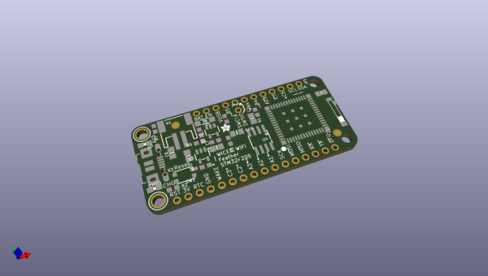
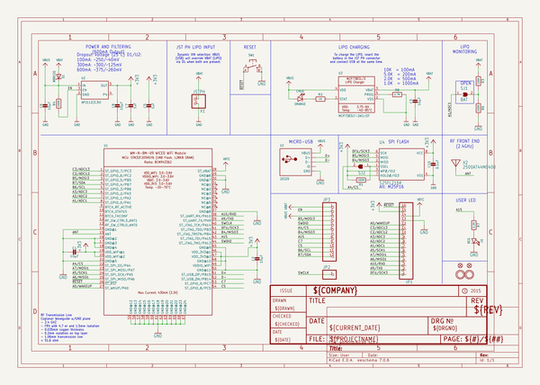
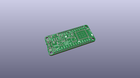
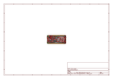
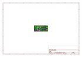
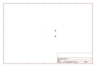
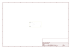
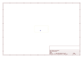
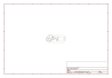

# OOMP Project  
## Adafruit-WICED-WiFi-Feather-PCB  by adafruit  
  
oomp key: oomp_projects_flat_adafruit_adafruit_wiced_wifi_feather_pcb  
(snippet of original readme)  
  
-- Adafruit WICED WiFi Feather PCB  
<a href="http://www.adafruit.com/products/3056">   
Click here to purchase one from the Adafruit shop</a>  
  
The WICED Feather is based on Cypress (formerly Broadcom) WICED (Wireless Internet Connectivity for Embedded Devices) platform, and is paired up with a powerful STM32F205 ARM Cortex M3 processor running at 120MHz, with support for TLS 1.2 to access sites and web services safely and securely.  
  
PCB files for the Adafruit WICED WiFi Feather. The format is EagleCAD schematic and board layout  
- https://www.adafruit.com/product/3056  
  
--- License  
  
Adafruit invests time and resources providing this open source design, please support Adafruit and open-source hardware by purchasing products from [Adafruit](https://www.adafruit.com)!  
  
All text above must be included in any redistribution  
  
Designed by Limor Fried/Ladyada for Adafruit Industries.  
Creative Commons Attribution/Share-Alike, all text above must be included in any redistribution.   
See license.txt for additional information.  
  
  full source readme at [readme_src.md](readme_src.md)  
  
source repo at: [https://github.com/adafruit/Adafruit-WICED-WiFi-Feather-PCB](https://github.com/adafruit/Adafruit-WICED-WiFi-Feather-PCB)  
## Board  
  
  
## Schematic  
  
  
  
[schematic pdf](working_schematic.pdf)  
## Images  
  
  
  
  
  
  
  
  
  
  
  
  
  
  
  
  
