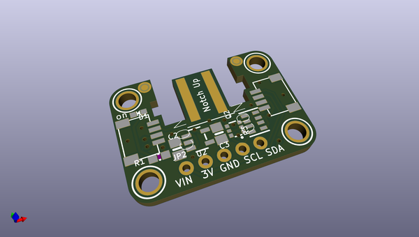
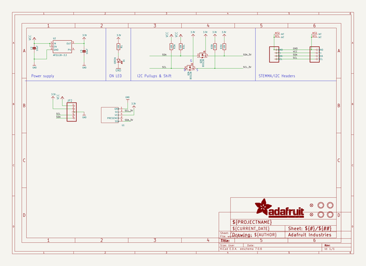
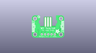
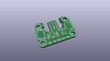
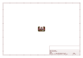
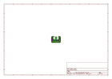
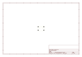
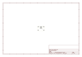
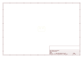
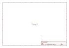

# OOMP Project  
## Adafruit-Wii-Nunchuck-Breakout-Adapter-PCB  by adafruit  
  
oomp key: oomp_projects_flat_adafruit_adafruit_wii_nunchuck_breakout_adapter_pcb  
(snippet of original readme)  
  
-- Adafruit Wii Nunchuck Breakout Adapter PCB  
  
<a href="http://www.adafruit.com/products/4836">   
Click here to purchase one from the Adafruit shop</a>  
  
PCB files for the Adafruit Wii Nunchuck Breakout Adapter.  
  
Format is EagleCAD schematic and board layout  
* https://www.adafruit.com/product/4836  
  
--- Description  
  
Dig out that old Wii controller and use it as a sleek controller for your next robot if you like. The Adafruit Adafruit Wii Nunchuck Breakout Adapter fits snugly into the Wii connector, and performs the level shifting and power regulation needed to use the controller with any microcontroller or microcomputer.  
  
The Wii controllers use a standard I2C interface, and there's existing code for both Arduino and CircuitPython/Python for quick integration with an Arduino UNO, Feather, or even a Raspberry Pi. We like to use these with the Wii Nunchuck, as you can get an X-Y joystick, two buttons and an accelerometer all in one hand-held package. All data is transmitted over I2C address 0x52, and the address can not be changed.  
  
We use extra thicc 2.0mm PCBs for this breakout, and made cut-outs for the grabber-notches, so that the controller connection is snug, and wont rattle or come loose!  
  
To make using it as easy as possible, we’ve created this breakout in Stemma QT form factor. You can either use a breadboard or the SparkFun qwiic compatible STEMMA QT connectors, and compatibility with 5V voltage levels as commonly fou  
  full source readme at [readme_src.md](readme_src.md)  
  
source repo at: [https://github.com/adafruit/Adafruit-Wii-Nunchuck-Breakout-Adapter-PCB](https://github.com/adafruit/Adafruit-Wii-Nunchuck-Breakout-Adapter-PCB)  
## Board  
  
  
## Schematic  
  
  
  
[schematic pdf](working_schematic.pdf)  
## Images  
  
  
  
  
  
  
  
  
  
  
  
  
  
  
  
  
