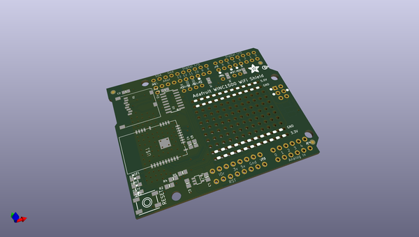
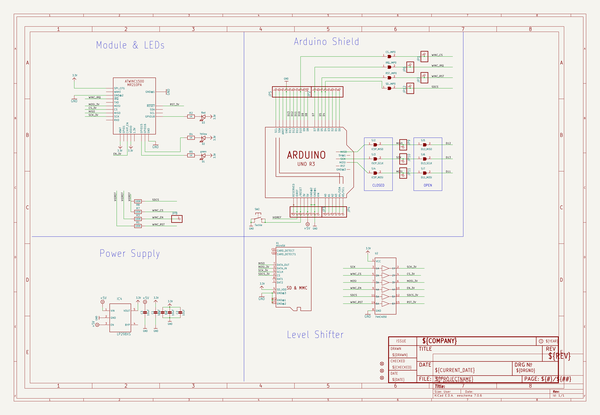
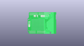
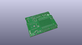
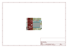
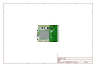
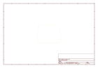
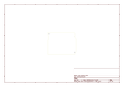
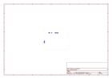
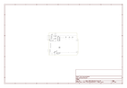

# OOMP Project  
## Adafruit-WINC1500-Shield-PCB  by adafruit  
  
oomp key: oomp_projects_flat_adafruit_adafruit_winc1500_shield_pcb  
(snippet of original readme)  
  
-- Adafruit WINC1500 Shield PCB  
  
<a href="http://www.adafruit.com/products/3654">&nbsp;   
<a href="http://www.adafruit.com/products/3653">   
Click a picture to purchase from the Adafruit shop</a>  
  
PCB files for the Adafruit WINC1500 Shields.   
  
For more details, check out the product page at  
* Adafruit WINC1500 WiFi Shield with uFL Connector https://www.adafruit.com/product/3654  
* Adafruit WINC1500 WiFi Shield with PCB Antenna https://www.adafruit.com/product/3653  
  
--- Description  
  
Connect your Arduino-compatible to the Internet with this WiFi shield that features the FCC-certified ATWINC1500 module from Atmel. This 802.11bgn-capable WiFi module is the best new thing for networking your devices, with SSL support and rock solid performance - running our adafruit.io MQTT demo for a full weekend straight with no hiccups (it would have run longer but we had to go to work, so we unplugged it).  
  
The Adafruit ATWINC1500 WiFi Shield uses SPI to communicate plus some GPIO for control, so with about 6 wires, you can get your wired up and ready to go. Right now the Atmel-supplied library works best with SAMD21-based boards like the Arduino Zero or Metro M0 Express or M4s, or the Arduino Mega. It will not work/fit on other Arduinos such as 328P or 32u4-based or attiny-based boards. You can clock it as fast as 12MHz for speedy, reliable packet streaming. And scanning/connecting to networks  
  full source readme at [readme_src.md](readme_src.md)  
  
source repo at: [https://github.com/adafruit/Adafruit-WINC1500-Shield-PCB](https://github.com/adafruit/Adafruit-WINC1500-Shield-PCB)  
## Board  
  
  
## Schematic  
  
  
  
[schematic pdf](working_schematic.pdf)  
## Images  
  
  
  
  
  
  
  
  
  
  
  
  
  
  
  
  
