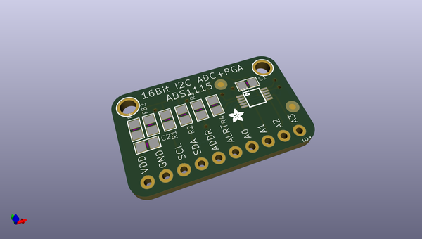
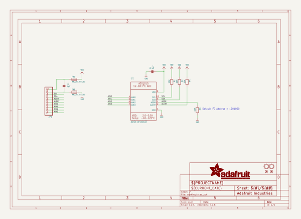
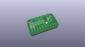
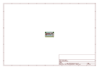
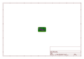
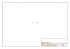
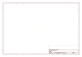
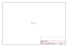

# OOMP Project  
## ADS1X15-Breakout-Board-PCBs  by adafruit  
  
oomp key: oomp_projects_flat_adafruit_ads1x15_breakout_board_pcbs  
(snippet of original readme)  
  
- PCB for the Adafruit 12 and 16 bit I2C ADC's with PGA  
  
<a href="http://www.adafruit.com/products/1083"> Click here to purchase one from the Adafruit shop</a>  
  
__Format is EagleCAD schematic and board layout__  
  
This PCB is both for [ADS1015](https://www.adafruit.com/product/1083) and [ADS1115](https://www.adafruit.com/product/1085).  
  
  
  full source readme at [readme_src.md](readme_src.md)  
  
source repo at: [https://github.com/adafruit/ADS1X15-Breakout-Board-PCBs](https://github.com/adafruit/ADS1X15-Breakout-Board-PCBs)  
## Board  
  
  
## Schematic  
  
  
  
[schematic pdf](working_schematic.pdf)  
## Images  
  
  
  
  
  
  
  
  
  
  
  
  
  
  
  
  
