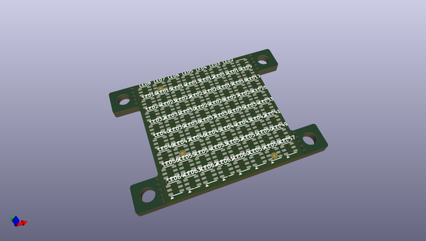
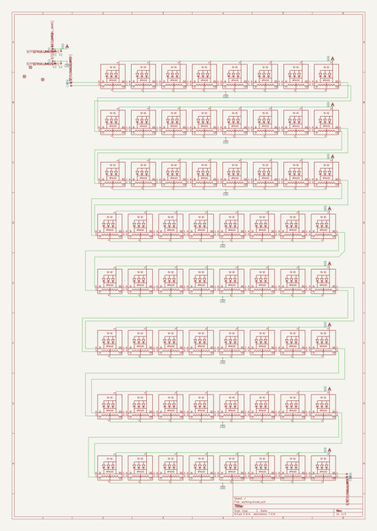
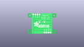
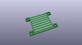
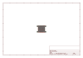
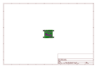
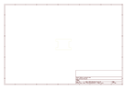
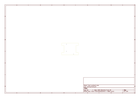
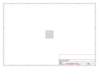

# OOMP Project  
## DotStar-2020-8x8-Matrix-PCB  by adafruit  
  
oomp key: oomp_projects_flat_adafruit_dotstar_2020_8x8_matrix_pcb  
(snippet of original readme)  
  
-- Adafruit DotStar High Density 8x8 Grid - 64 RGB LED Pixel Matrix PCB  
  
<a href="http://www.adafruit.com/products/3444">   
Click here to purchase one from the Adafruit shop</a>  
  
PCB files for the Adafruit DotStar High Density 8x8 Grid - 64 RGB LED Pixel Matrix. Format is EagleCAD schematic and board layout  
* https://www.adafruit.com/product/3444  
  
--- Description  
  
Do not eat this LED grid just because it is so colorful and bite-sized! This is the tiniest little LED grid we could make, with 64 full RGB color pixels in a square that is only 1" by 1" square (thats 25.4mm x 25.4mm for you metric-lovers). Best of all, these are little DotStar LEDs, with built in PWM drivers, so you only need two digital I/O pins to get a-glowin'.  
  
But do not be fooled by their small size, each LED is still incredibly, blindingly bright just like the DotStars/NeoPixels you know and love. These are the same integrated LEDs that are used in [our new fancy DotStar strips](https://www.adafruit.com/categories/885) just really small.  
  
Arranged in an 8x8 matrix, each pixel is individually addressable: like NeoPixels, DotStar LEDs have an embedded microcontroller **inside the LED**. You can set the color/brightness of each LED to 24-bit color (8 bits each red green and blue). Each LED acts like a shift register, reading incoming color data on the input pins, and then shifting the previous color data out on the output pin. By sending a long string of data  
  full source readme at [readme_src.md](readme_src.md)  
  
source repo at: [https://github.com/adafruit/DotStar-2020-8x8-Matrix-PCB](https://github.com/adafruit/DotStar-2020-8x8-Matrix-PCB)  
## Board  
  
  
## Schematic  
  
  
  
[schematic pdf](working_schematic.pdf)  
## Images  
  
  
  
  
  
  
  
  
  
  
  
  
  
  
  
  
