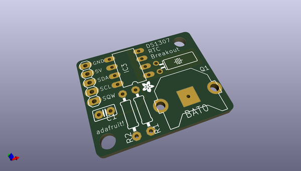
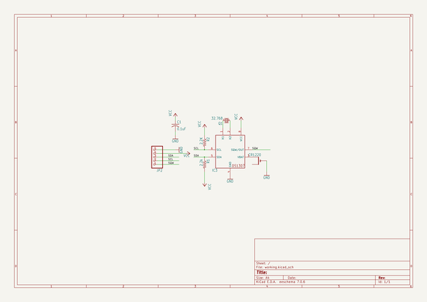
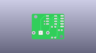
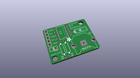
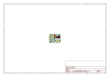
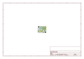
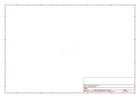
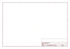
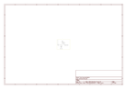

# OOMP Project  
## DS1307-breakout-board  by adafruit  
  
oomp key: oomp_projects_flat_adafruit_ds1307_breakout_board  
(snippet of original readme)  
  
-- Adafruit DS1307 Real Time Clock Assembled Breakout Board PCB  
  
<a href="http://www.adafruit.com/products/3296">   
Click here to purchase one from the Adafruit shop</a>  
  
PCB files for the Adafruit DS1307 Real Time Clock Assembled Breakout Board. Format is EagleCAD schematic and board layout  
* https://www.adafruit.com/product/3296  
  
--- Description  
  
This is a great battery-backed real time clock (RTC) that allows your microcontroller project to keep track of time even if it is reprogrammed, or if the power is lost. Perfect for datalogging, clock-building, time stamping, timers and alarms, etc. The DS1307 is the most popular RTC - but it requires 5V power to work (although we've used it with 5V power and 3.3V logic successfully)  
  
Works great with an [Arduino using our RTC library](https://github.com/adafruit/RTClib) or with a [Raspberry Pi (or similar single board linux computer)](https://learn.adafruit.com/adding-a-real-time-clock-to-raspberry-pi)  
  
The DS1307 is simple and inexpensive but not a high precision device. It may lose or gain up to 2 seconds a day. For a high-precision, temperature compensated alternative, [please check out the DS3231 precision RTC](https://www.adafruit.com/products/3013). If you do not need a DS1307, or you need a 3.3V-power/logic capable RTC please check out our affordable [PCF8523 RTC breakout](http://www.adafruit.com/products/3295)  
  
--- License  
  
Adafruit invests time and resources providing th  
  full source readme at [readme_src.md](readme_src.md)  
  
source repo at: [https://github.com/adafruit/DS1307-breakout-board](https://github.com/adafruit/DS1307-breakout-board)  
## Board  
  
  
## Schematic  
  
  
  
[schematic pdf](working_schematic.pdf)  
## Images  
  
  
  
  
  
  
  
  
  
  
  
  
  
  
  
  
