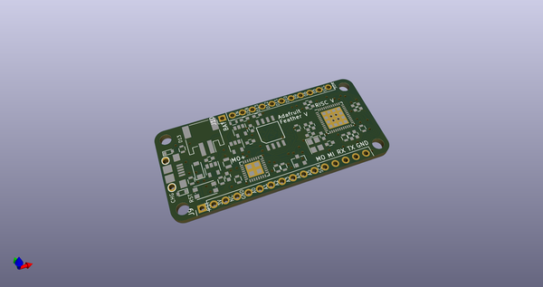
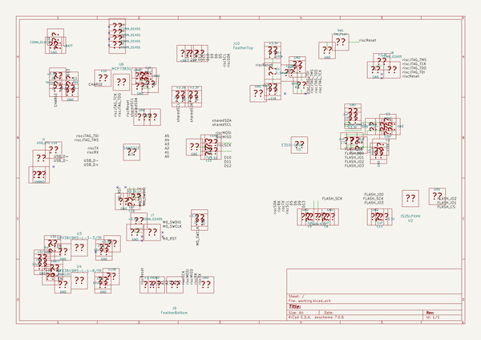
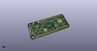
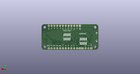
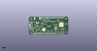

# OOMP Project  
## Feather-RISC-V-PCB  by adafruit  
  
(snippet of original readme)  
  
- Feather RISC-V -  
This is a Feather board featuring a [SiFive Freedom E310](https://www.sifive.com/products/freedom-e310/), a RISC-V microcontroller that is [open source](https://github.com/sifive/freedom).  
  
-- Contributing --  
Please note that this project is released with a [Contributor Code of Conduct](CODE_OF_CONDUCT.md). By participating in this project you agree to abide by its terms.  
  
--- Setup ---  
Components and footprints for PCB parts are not included in this repository. Instead, checkout the [adafruit/kicad-libs](https://github.com/adafruit/kicad-libs) repository in the same directory that this repository is checked out in. All part definitions should be relative so that they will load correctly.  
  
--- Pull requests ---  
For fixes please submit a pull request to the original repository.  
  
--- Derivatives ---  
If developing your own version of the Feather RISC-V please remove all Chickadee Tech and Adafruit trademarks and follow the [CC-BY license](LICENSE). While not required, please consider open sourcing your modifications so others can learn from your improvements.  
  
  full source readme at [readme_src.md](readme_src.md)  
  
source repo at: [https://github.com/adafruit/Feather-RISC-V-PCB](https://github.com/adafruit/Feather-RISC-V-PCB)  
## Board  
  
  
## Schematic  
  
  
  
[schematic pdf](working_schematic.pdf)  
## Images  
  
  
  
  
  
  
