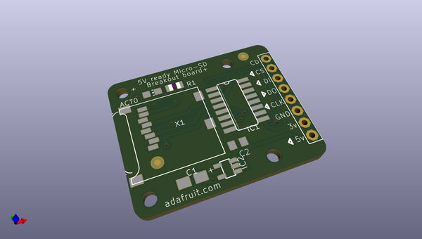
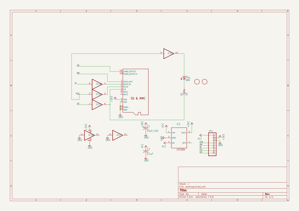
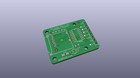
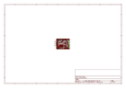
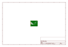
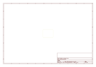
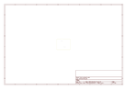
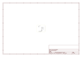

# OOMP Project  
## MicroSD-breakout-board  by adafruit  
  
oomp key: oomp_projects_flat_adafruit_microsd_breakout_board  
(snippet of original readme)  
  
-- Adafruit MicroSD breakout board PCB  
<a href="http://www.adafruit.com/products/254">   
Click here to purchase one from the Adafruit shop</a>  
  
Not just a simple breakout board, this microSD adapter goes the extra mile - designed for ease of use.  
  
- Onboard 5v->3v regulator provides 150mA for power-hungry cards  
- 3v level shifting means you can use this with ease on either 3v or 5v systems  
- Uses a proper level shifting chip, not resistors: less problems, and faster read/write access  
- Use 3 or 4 digital pins to read and write 2Gb+ of storage!  
- Activity LED lights up when the SD card is being read or written  
- Four -2 mounting holes  
- Push-push socket with card slightly over the edge of the PCB so its easy to insert and remove  
- Comes with 0.1" header (unattached) so you can get it on a breadboard or use wires - your choice  
- Tested and assembled here at the Adafruit factory  
- Works great with Arduino, with tons of example code and wiring diagrams  
  
This repo contains the PCB files for the Adafruit SPI Micro SD (transflash) breakout board  
  
--- License  
  
Adafruit invests time and resources providing this open source design, please support Adafruit and open-source hardware by purchasing products from [Adafruit](https://www.adafruit.com)!  
  
All text above must be included in any redistribution  
  
Designed by Limor Fried/Ladyada for Adafruit Industries.  
Creative Commons Attribution/Share-Alike, all text above must be included in a  
  full source readme at [readme_src.md](readme_src.md)  
  
source repo at: [https://github.com/adafruit/MicroSD-breakout-board](https://github.com/adafruit/MicroSD-breakout-board)  
## Board  
  
  
## Schematic  
  
  
  
[schematic pdf](working_schematic.pdf)  
## Images  
  
  
  
  
  
  
  
  
  
  
  
  
  
  
  
  
