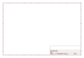

# OOMP Project  
## monochron  by adafruit  
  
(snippet of original readme)  
  
- MONOCHRON Clock kit - Open source clock platform, make clocks!  
  
  
  
MONOCHRON® is a new clock kit from Adafruit! This easy kit is easily hackable to do whatever you wish, it's a clock platform - have fun!  
  
- [128x64](https://learn.adafruit.com/system/assets/assets/000/010/412/original/lcd12864black.jpg) LCD (KS0108) - we special-ordered the black and white display!  
- ATmega328 processor (we even stuck an 'arduino' stk500 bootloader on there too for hacking ease)  
- [Laser cut enclosure in black acrylic](https://learn.adafruit.com/monochron/case-it)  
- [Beeping/blinking alarm with 10 minute snooze](https://learn.adafruit.com/monochron/alarm)  
- Battery backed-up real time clock ([DS1307](https://www.adafruit.com/partfinder/ic-rtc)) keeps time even when power is lost for years  
- [European/US and 12/24 hour time display as well as date](https://learn.adafruit.com/monochron/date)  
- [Completely open source hardware, all firmware, layout and CAD files are yours to mess with](https://learn.adafruit.com/monochron/download)  
- Plenty of space for mods, a prototyping area for soldering stuff in  
  
Comes with: clock kit (includes all parts, programmed chips and LCD), coin battery, enclosure, [9VDC power supply for 220V or 110V](https://www.adafruit.com/products/63)  
  
The firmware shipped with the kit is for the Retro Arcade Table Tennis for Two as shown in the video below. We have other clock   
  full source readme at [readme_src.md](readme_src.md)  
  
source repo at: [https://github.com/adafruit/monochron](https://github.com/adafruit/monochron)  
## Board  
  
  
## Schematic  
  
  
  
[schematic pdf](working_schematic.pdf)  
## Images  
  
  
  
  
  
  
  
  
  
  
  
  
  
  
  
  
