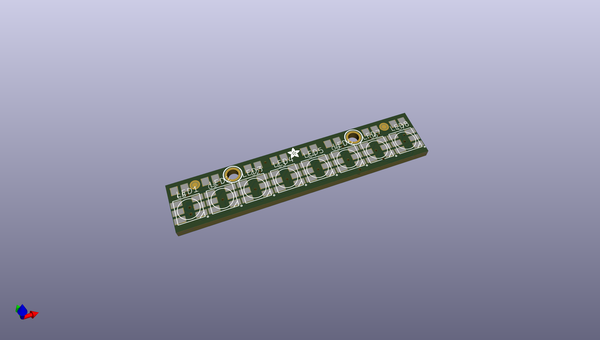
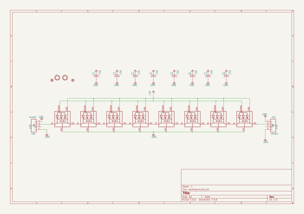
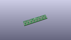
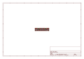
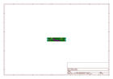
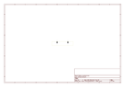
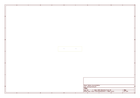
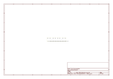

# OOMP Project  
## NeoPixel-Sticks  by adafruit  
  
oomp key: oomp_projects_flat_adafruit_neopixel_sticks  
(snippet of original readme)  
  
- NeoPixel Stick  
  
__Format is EagleCAD schematic and board layout__  
  
<a href="http://www.adafruit.com/products/1426"> Click here to purchase one from the Adafruit shop</a>  
  
Make your own little LED strip arrangement with this stick of NeoPixel LEDs. We crammed 8 of the tiny 5050 (5mm x 5mm) smart RGB LEDs onto a PCB with mounting holes and a chainable design. Use only one microcontroller pin to control as many as you can chain together! Each LED is addressable as the driver chip is inside the LED. Each one has ~18mA constant current drive so the color will be very consistent even if the voltage varies, and no external choke resistors are required making the design slim. Power the whole thing with 5VDC (4-7V works) and you're ready to rock.  
  
The LEDs are 'chainable' by connecting the output of one stick into the input of another - see the photo above. There is a single data line with a very timing-specific protocol. Since the protocol is very sensitive to timing, it requires a real-time microconroller such as an AVR, Arduino, PIC, mbed, etc. It cannot be used with a Linux-based microcomputer or interpreted microcontroller such as the netduino or Basic Stamp. Our wonderfully-written [Neopixel library for Arduino supports these pixels!](https://github.com/adafruit/Adafruit_NeoPixel) As it requires hand-tuned assembly it is only for AVR cores but others may have ported this chip driver code so please google around. An 8MHz or  
  full source readme at [readme_src.md](readme_src.md)  
  
source repo at: [https://github.com/adafruit/NeoPixel-Sticks](https://github.com/adafruit/NeoPixel-Sticks)  
## Board  
  
  
## Schematic  
  
  
  
[schematic pdf](working_schematic.pdf)  
## Images  
  
  
  
  
  
  
  
  
  
  
  
  
  
  
  
  
