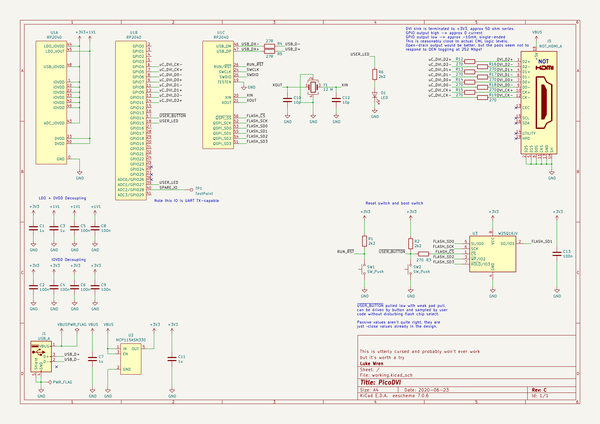
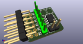
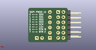
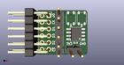

# OOMP Project  
## PicoDVI  by adafruit  
  
oomp key: oomp_projects_flat_adafruit_picodvi  
(snippet of original readme)  
  
PicoDVI - Adafruit Fork for Arduino IDE + Adafruit_GFX compatibility  
====================================================================  
(Original Readme content follows later)  
  
Implements a few framebuffer types to which Adafruit_GFX drawing operations  
can be made; not every permutation PicoDVI is capable of, but a useful subset.  
  
WARNING: all video modes require overclocking (performed automatically at  
run-time, nothing to select), occasionally over-volting (optionally selected  
in sketch code), and higher resolutions may require reducing the QSPI clock  
rate (Tools menu in future arduino-pico release). The RP2040 microcontroller  
is being run WAY beyond spec and there is a VERY SMALL BUT NONZERO  
POSSIBILITY OF PERMANENT DAMAGE. Please see LICENSE file; usual software  
disclaimers about liability apply, user accepts risk.  
  
Requires Earle Philhower III RP2040 Arduino core (not the "official" Arduino  
RP2040 core).  
  
Changes vs main PicoDVI repo:  
- Add library.properties file, src and examples directories per Arduino  
requirements.  
- A full copy of software/libdvi is made in src (originally was soft-linked but Arduino Library Manager does not approve). If any updates are made in the original PicoDVI libdvi directory, copy them here!  
- The file dvi_serialiser.pio.h, normally not part of the distribution and  
generated during the Pico SDK build process, is provided here for Arduino  
build to work. If any changes are made in dvi_serialiser.pio (either here  
or by bringing in updates from  
  full source readme at [readme_src.md](readme_src.md)  
  
source repo at: [https://github.com/adafruit/PicoDVI](https://github.com/adafruit/PicoDVI)  
## Board  
  
  
## Schematic  
  
  
  
[schematic pdf](working_schematic.pdf)  
## Images  
  
  
  
  
  
  
