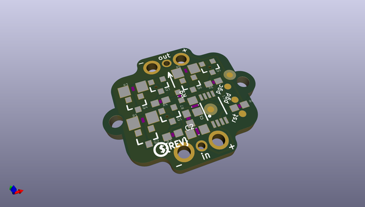
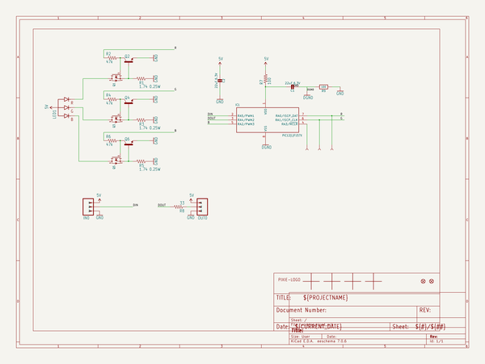
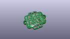
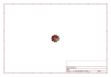
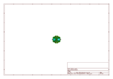
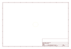
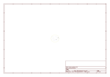
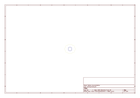
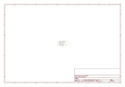

# OOMP Project  
## Pixie-3W-Smart-LED-PCB  by adafruit  
  
(snippet of original readme)  
  
-- Adafruit Pixie 3W Smart LED PCB  
<a href="http://www.adafruit.com/products/2741">   
Click here to purchase one from the Adafruit shop</a>  
  
NeoPixels are plenty bright, suuuure. BUT ARE THEY 3 WATTS BRIGHT? No! They are not! That's why you need a Pixie. These chainable smart LEDs are not only super-smart, they are ridonkulously bright with 3W total, compared to 0.2W of a 'standard' NeoPixel. Designed by Ytai Ben-Tsvi, these are the ultimate in LEDs.  
  
Each Pixie not only contains that aforementioned 3W LED, it also has a Microchip PIC microcontroller. You send it the color you want to appear at standard 115200 baud (1 byte per color). You can send a longer string of pixel data and it will 'forward' along the messages so you can chain them like a shift register. You only have to send the data once per color change. Once set, the microcontroller does all the PWM handling for you.  
  
PCB files for the Pixie 3W Smart LED. The format is EagleCAD schematic and board layout  
- http://www.adafruit.com/products/2741  
  
--- License  
  
Adafruit invests time and resources providing this open source design, please support Adafruit and open-source hardware by purchasing products from [Adafruit](https://www.adafruit.com)!  
  
All text above must be included in any redistribution  
  
Designed by Limor Fried/Ladyada for Adafruit Industries.  
Creative Commons Attribution/Share-Alike, all text above must be included in any redistribution.   
See license.txt  
  full source readme at [readme_src.md](readme_src.md)  
  
source repo at: [https://github.com/adafruit/Pixie-3W-Smart-LED-PCB](https://github.com/adafruit/Pixie-3W-Smart-LED-PCB)  
## Board  
  
  
## Schematic  
  
  
  
[schematic pdf](working_schematic.pdf)  
## Images  
  
  
  
  
  
  
  
  
  
  
  
  
  
  
  
  
