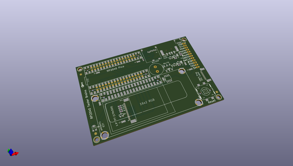
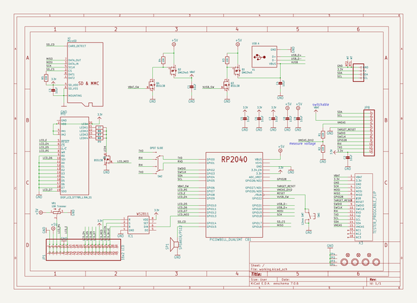
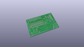
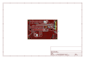
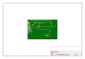
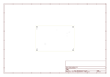
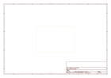
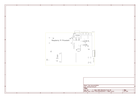

# OOMP Project  
## RP2040-Based-Tester-Brains-PCB  by adafruit  
  
oomp key: oomp_projects_flat_adafruit_rp2040_based_tester_brains_pcb  
(snippet of original readme)  
  
-- Adafruit RP2040 Based Tester Brains PCB  
  
  
  
PCB files for the Adafruit RP2040 Based Tester Brains.   
  
Format is EagleCAD schematic and board layout  
  
--- Description  
  
This board is what we use internally at Adafruit to program and test boards with microcontrollers on them.   
   * An [RP2040 Pico](https://www.adafruit.com/product/5525) (or perhaps PicoW?) is used to run the test software  
   * [Use a 16x2 LCD (ideally RGB backlight)](https://www.adafruit.com/product/398) for display output with color feedback such as green for pass, red for fail. RGB backlight is WS2811-controlled. Don't forget to set the contrast pot on first usage.  
   * Serial1 hardware UART has RX/TX pin switch to flip directions  
   * 1.9" TFT connector is placed but hasn't been tested or used yet  
   * Piezo buzzer can be used for audible feedback alerts  
   * STEMMA QT I2C port  
   * Big reset button  
   * Firmware files can be stored on MicroSD card which is slotted in.   
   * Connect the right hand side, either the 0.1" header or 18-pin EYESPI-like FPC connector to the device-under-test jig which can be different for each product.   
   * [USB Host testing is done with bitbang PIO support in TinyUSB](https://github.com/adafruit/Adafruit_TinyUSB_Arduino), USB 5V power can be turned on / off   
   * Use Philhower RP2040 core for programming  
   * The RP2040 brains can perform ESP32 programming, RP2040-via-USB, AVR ICSP/UPDI, or SWD DAP. [See the TestBed library for some   
  full source readme at [readme_src.md](readme_src.md)  
  
source repo at: [https://github.com/adafruit/RP2040-Based-Tester-Brains-PCB](https://github.com/adafruit/RP2040-Based-Tester-Brains-PCB)  
## Board  
  
  
## Schematic  
  
  
  
[schematic pdf](working_schematic.pdf)  
## Images  
  
  
  
  
  
  
  
  
  
  
  
  
  
  
  
  
