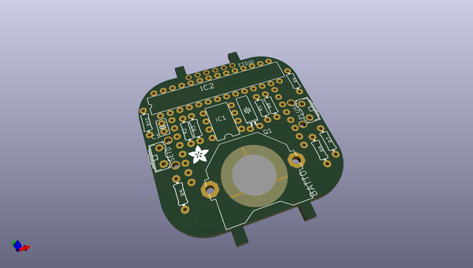
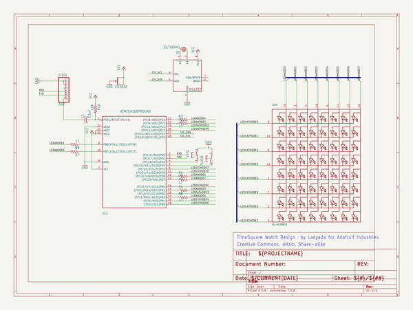
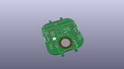
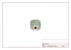
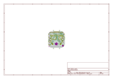
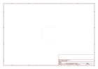
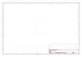
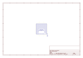
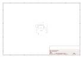

# OOMP Project  
## TIMESQUARE-DIY-Watch-Kit  by adafruit  
  
(snippet of original readme)  
  
- PCB for the Adafruit TIMESQUARE DIY Watch Kit   
  
<a href="http://www.adafruit.com/products/1106"> Click here to purchase one from the Adafruit shop</a>  
  
__Format is EagleCAD schematic and board layout__  
  
Show up stylish AND on time to any event with this awesome looking DIY watch. We have a few watch kits here at Adafruit but we finally have one that looks good and fits well, even for ladies and kids and others with smaller wrists and hands. Its got an 8x8 bit matrix display and a repurposed silicone watch band for a professional look.  
  
64 LEDs light up to tell you the time in a variety of ways. Built into the kit are 3 different watch 'faces' - a scrolling marquee with time and date, a binary watch display (for geeks, robots, and binary fans), and a moon phase display (for beach-combers, werewolves). There's also a built-in battery meter so you can check your battery life. [Want to make your own watch? Easy! The microcontroller is an Arduino-compatible, all you need is an FTDI Friend and the Arduino IDE and you can design your own watch faces and upload them to the TIMESQUARE.](http://learn.adafruit.com/timesquare-watch-kit/uploading-new-firmware)  
  
Engineered for greatness by PaintYourDragon, this watch squeezes 500-1000 full time displays out of a coin battery, and up to one year 'resting' lifetime, so you can use this as a day-to-day timekeeper.  
  
This watch comes with an ultra bright red LED matrix and a black silicon  
  full source readme at [readme_src.md](readme_src.md)  
  
source repo at: [https://github.com/adafruit/TIMESQUARE-DIY-Watch-Kit](https://github.com/adafruit/TIMESQUARE-DIY-Watch-Kit)  
## Board  
  
  
## Schematic  
  
  
  
[schematic pdf](working_schematic.pdf)  
## Images  
  
  
  
  
  
  
  
  
  
  
  
  
  
  
  
  
