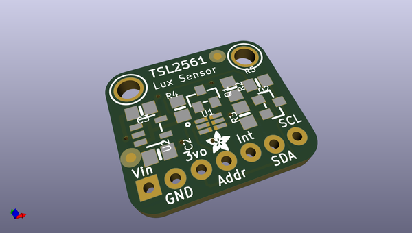
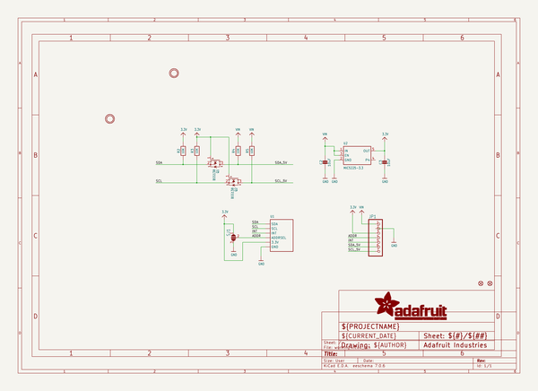
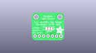
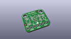
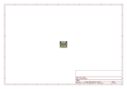
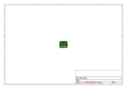
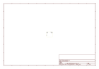
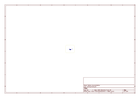

# OOMP Project  
## TSL2561-breakout-board-PCB  by adafruit  
  
(snippet of original readme)  
  
-- TSL2561 breakout board PCB  
  
<a href="http://www.adafruit.com/products/1980">   
Click picture or link below to purchase one from the Adafruit shop</a>  
  
PCB CAD files for the Adafruit TSL2591 High Dynamic Range Digital Light Sensor.   
PCB format is EagleCAD schematic and board layout  
  
For more details, check out the product page at  
* https://www.adafruit.com/products/1980  
  
--- Description  
  
When the future is dazzlingly-bright, this ultra-high-range luminosity sensor will help you measure it. The TSL2591 luminosity sensor is an advanced digital light sensor, ideal for use in a wide range of light situations. Compared to low cost CdS cells, this sensor is more precise, allowing for exact lux calculations and can be configured for different gain/timing ranges to detect light ranges from 188 uLux up to 88,000 Lux on the fly.  
  
The best part of this sensor is that it contains both infrared and full spectrum diodes! That means you can separately measure infrared, full-spectrum or human-visible light. Most sensors can only detect one or the other, which does not accurately represent what human eyes see (since we cannot perceive the IR light that is detected by most photo diodes) This sensor is much like the TSL2561 but with a wider range (and the interface code is different). This sensor has a massive 600,000,000:1 dynamic range! Unlike the TSL2561 you cannot change the I2C address, so keep that in mind.  
  
The built in ADC means yo  
  full source readme at [readme_src.md](readme_src.md)  
  
source repo at: [https://github.com/adafruit/TSL2561-breakout-board-PCB](https://github.com/adafruit/TSL2561-breakout-board-PCB)  
## Board  
  
  
## Schematic  
  
  
  
[schematic pdf](working_schematic.pdf)  
## Images  
  
  
  
  
  
  
  
  
  
  
  
  
  
  
  
  
