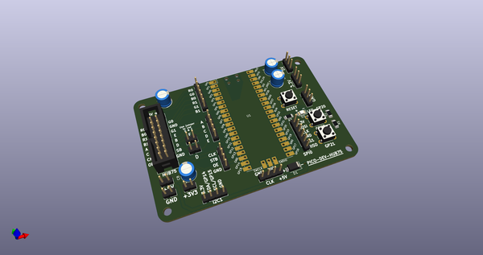
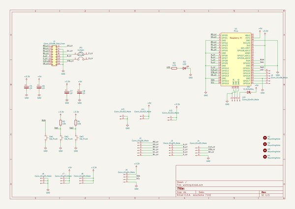
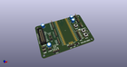
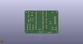
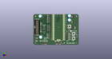

# OOMP Project  
## u2if  by adafruit  
  
(snippet of original readme)  
  
- u2if project  
  
u2if(USB to interfaces) is an attempt to implement some of the MicroPython "machine" module functionalities on a computer.  
The goal is to be able to communicate with breakout boards (sensors, lcd...) simply from a python program on x86 machine. It uses a Raspberry PICO (or other RP2040 based board) to make the interface between the computer (USB) and peripherals/protocols.  
  
<p align="center"></p>  
  
**Python led swith on/off**:  
```python  
import time  
from machine import u2if, Pin  
  
- Initialize GPIO to output and set the value HIGH  
led = Pin(u2if.GP3, Pin.OUT, value=Pin.HIGH)  
time.sleep(1)  
- Switch off the led  
led.value(Pin.LOW)  
```  
  
-- Caution  
  
It is in experimental state and not everything has been tested. Use with caution. It is supposed to work on windows, linux and Mac.  
To work in Linux in non-root, an udev rules has to be added (See [Firmware readme](firmware/README.md)).  
  
  
-- Why this project ?  
When I want to retrieve values from a sensor or even to play with a led or a button from the PC, I make an arduino program that communicate to the PC via the serial port. That umplies to define a serial "protocol" between the PC and the arduino and it is not necessarily reusable because it is specific. I find it interesting to implement a majority of the functionalities of the MicroPython machine module and add other protocols.  
  
Solutions already exist, for example [Adafruit Blinka](https://github.com/adafruit/Adafruit_Blinka) from Ad  
  full source readme at [readme_src.md](readme_src.md)  
  
source repo at: [https://github.com/adafruit/u2if](https://github.com/adafruit/u2if)  
## Board  
  
[](working_3d.png)  
## Schematic  
  
[](working_schematic.png)  
  
[schematic pdf](working_schematic.pdf)  
## Images  
  
[](working_3d.png)  
  
[](working_3d_back.png)  
  
[](working_3d_front.png)  
