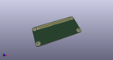
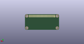
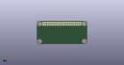

# OOMP Project  
## agg-kicad  by adamgreig  
  
oomp key: oomp_projects_flat_adamgreig_agg_kicad  
(snippet of original readme)  
  
- @adamgreig's KiCAD Library  
  
This repository contains my collection of KiCAD symbols, footprints,  
and related files.  
  
Every symbol and footprint is very carefully checked against either the  
relevant standard (generally IPC-7351B) or specific manufacturer footprints.  
Many are procedurally generated from a simple set of dimensions, which ensures  
consistency and correctness. My objective is to have a useful collection of  
correct parts that all look consistent and work well together.  
  
I encourage other people to use these parts; they're all licensed under a  
permissive MIT licence and it's easy to simply copy one or two files from the  
repository, or submodule the entire repo.  
  
Contributions are also very welcome; please open a pull request and I will  
carefully review the proposed additions. All contributions are likewise  
licensed under the MIT licence.  
  
A number of automatic rules are checked against every footprint and symbol on  
each commit by the build system. The current status is:  
  
  
-- Schematic Symbols  
  
To use, add relevant `.kicad_sym` files to your project libraries. There is one   
`.kicad_sym` file per symbol.  
  
Alternatively add `agg-kicad.kicad_sym` from the root directory, which includes  
all symbols. This file is built using `scripts/compile_lib.py` and kept  
up-to-date automatically.  
  
Each part contains supplier order codes and manufacturer part number  
  full source readme at [readme_src.md](readme_src.md)  
  
source repo at: [https://github.com/adamgreig/agg-kicad](https://github.com/adamgreig/agg-kicad)  
## Board  
  
  
## Schematic  
  
  
  
[schematic pdf](working_schematic.pdf)  
## Images  
  
  
  
  
  
  
