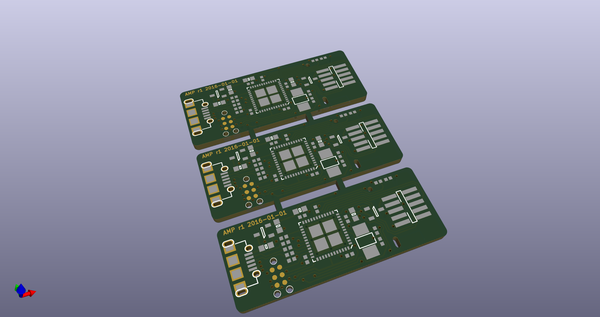
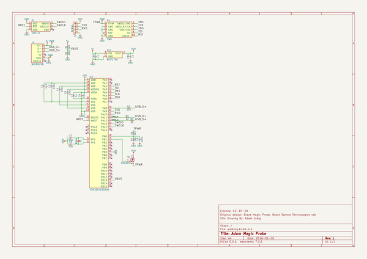
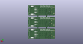
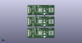

# OOMP Project  
## amp  by adamgreig  
  
(snippet of original readme)  
  
- Adam Magic Probe  
  
A clone of the wonderful  
[Black Magic Probe](http://www.blacksphere.co.nz/main/blackmagic) but in KiCAD   
and with a few small hardware tweaks.  
  
As such this work is also distributed under the CC-BY-SA licence.  
  
This is a really useful tool for ARM development and I'm incredibly grateful   
that it's open hardware and firmware. You should consider buying one!  
  
-- Changes From Black Magic Mini  
  
* MicroUSB port  
* No LEDs  
* Cheaper, higher current LDO  
* TagConnect for programming the host STM32  
  
  full source readme at [readme_src.md](readme_src.md)  
  
source repo at: [https://github.com/adamgreig/amp](https://github.com/adamgreig/amp)  
## Board  
  
  
## Schematic  
  
  
  
[schematic pdf](working_schematic.pdf)  
## Images  
  
  
  
  
  
  
