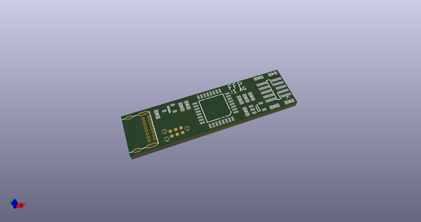
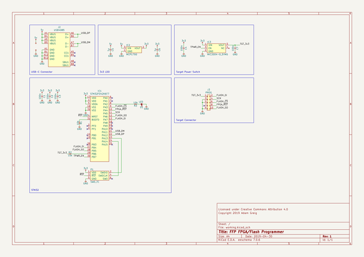
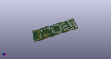
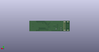
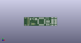

# OOMP Project  
## ffp  by adamgreig  
  
(snippet of original readme)  
  
- FFP: Flash/FPGA Programmer  
  
FFP is a dead-simple USB to bidirectional SPI bridge for programming iCE40  
FPGAs and SPI flashes. The hardware is an STM32F042 and not much else.  
Firmware and host software is written in Rust.  
  
The firmware additionally supports SWD via the CMSIS-DAP v1 and v2 protocols,  
so many debuggers such as [probe-rs], [OpenOCD], and [pyOCD] are able to  
use an FFP to debug and program Cortex-M and other microcontrollers.  
  
[probe-rs]: https://probe.rs  
[OpenOCD]: http://openocd.org  
[pyOCD]: https://github.com/mbedmicro/pyOCD  
  
  
  
See [software/](software/) for the host-side software, [firmware/](firmware/)  
for the embedded device firmware, and [hardware/](hardware/ffp/) for the  
hardware design files.  
  
-- Pinout  
  
The FFP r1 hardware uses a 5x2 pin 0.05"-pitch connector, which is also  
commonly used for Cortex family microcontrollers for SWD and JTAG. The pinout  
is deliberately compatible (though note `RESET` is moved) to allow hardware  
reuse and for compatibility with tools such as TagConnect cables.  
  
```ascii  
          ______  
    3v3 --|1  2|-- FLASH DI / FPGA DO / SWDIO  
    GND --|3  4|-- CLK / SWCLK  
    GND --|5  6|-- CS / SWO  
        x-|7  8|-- FPGA nRST  
    GND --|9 10|-- FLASH DO / FPGA DI / nRESET  
          ------  
  
```  
  
This is the same pinout used by  
[amp_flashprog](https://github.com/adamgreig/amp_flashprog), a custom firmware  
for [Black Magic Probes](https://github.com/blacksphere/blackmagic) to bitbang  
SPI to the same en  
  full source readme at [readme_src.md](readme_src.md)  
  
source repo at: [https://github.com/adamgreig/ffp](https://github.com/adamgreig/ffp)  
## Board  
  
[](working_3d.png)  
## Schematic  
  
[](working_schematic.png)  
  
[schematic pdf](working_schematic.pdf)  
## Images  
  
[](working_3d.png)  
  
[](working_3d_back.png)  
  
[](working_3d_front.png)  
