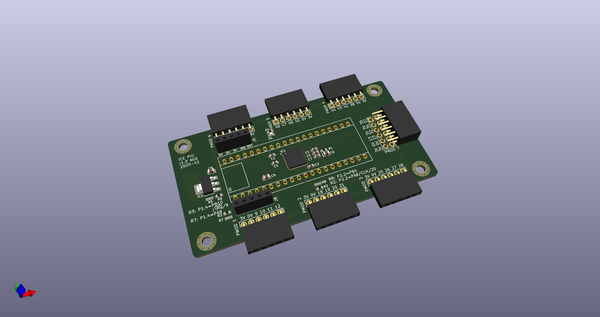
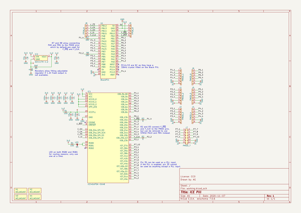
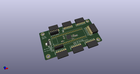
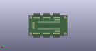
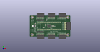

# OOMP Project  
## icepill  by adamgreig  
  
oomp key: oomp_projects_flat_adamgreig_icepill  
(snippet of original readme)  
  
- iCE Pill  
  
Breakout board for iCE40UP5k with the STM32F411 "Black Pill" board.  
  
  
  
This board breaks all the iCE40UP5k GPIO to PMOD headers, most of which are  
also connected to Black Pill pins, allowing either the STM32 or the iCE40 to  
drive each PMOD pin. The iCE40's SPI and configuration pins are connected to  
the Black Pill, allowing the STM32 to program and control the iCE40.  
  
The SPI and configuration pins are also exposed on the J8 and J9 pin headers,  
allowing connection just to these signals and then all PMOD pins can be  
exclusively used by the iCE40.  
  
Two additional STM32 pins can be connected to the iCE40: PA8, which can be used  
in its MCO or TIM1 CH1 alternate modes to generate a clock for the iCE40, and  
PB10, which can be used to signal an interrupt from the iCE40. Zero-ohm  
resistors are be fitted in R2 and R3 to connect these signals to PMOD pins  
as well, and zero-ohm resistors can optionally be fitted in R7 and R8 to  
connect PA9 and PB4 from the STM32 to the same PMOD pins. This configuration  
means the iCE40 is always connected to PA8 (clock) and PB10 (interrupt), and  
either those iCE40 pins can connect to the PMOD _or_ the STM32 pins PA9 and PB4  
can connect to the PMOD instead.  
  
R5 and R6 are present in case a 1.2V fixed LDO is not available and you need  
to use an adjustable LDO. Otherwise, leave R5 not fitted and use a zero-ohm  
resistor for R6 (the default).  
  
The LED D1 is connected to the RGB0 _and_ RGB1 pins on the iCE40 to simplify  
ro  
  full source readme at [readme_src.md](readme_src.md)  
  
source repo at: [https://github.com/adamgreig/icepill](https://github.com/adamgreig/icepill)  
## Board  
  
  
## Schematic  
  
  
  
[schematic pdf](working_schematic.pdf)  
## Images  
  
  
  
  
  
  
