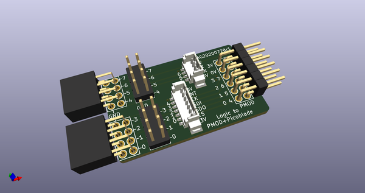
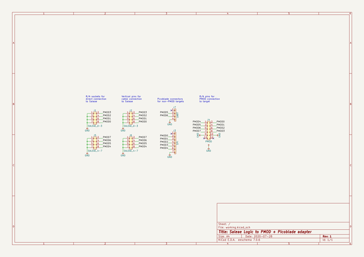
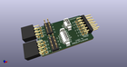
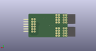
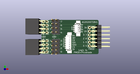

# OOMP Project  
## logic_adapters  by adamgreig  
  
oomp key: oomp_projects_flat_adamgreig_logic_adapters  
(snippet of original readme)  
  
- Adapter PCBs for Saleae Logic  
  
-- PMOD + Picoblade  
  
Connects a Saleae Logic or other logic analyser to a double-PMOD socket header  
and to two Picoblade connectors, one 4-pin and one 7-pin.  
  
  
  
-- Cortex Debug  
  
Connects a Saleae Logic or other logic analyser to two Cortex Debug 2x5 0.05"  
connectors which are connected together, allowing analysis of signals between  
a debugger and a target.  
  
  
  
  full source readme at [readme_src.md](readme_src.md)  
  
source repo at: [https://github.com/adamgreig/logic_adapters](https://github.com/adamgreig/logic_adapters)  
## Board  
  
  
## Schematic  
  
  
  
[schematic pdf](working_schematic.pdf)  
## Images  
  
  
  
  
  
  
