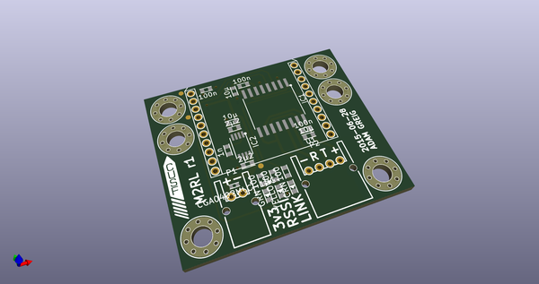
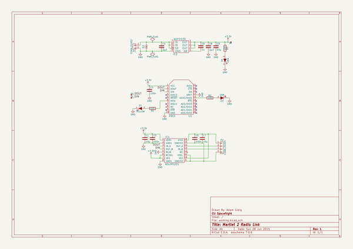
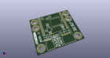
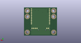
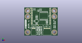

# OOMP Project  
## m2-electronics  by adamgreig  
  
(snippet of original readme)  
  
- Martlet 2 Flight Computers  
  
This repository contains the schematics, PCB designs and firmware for the  
various electronic systems onboard Martlet 2.  
  
-- M2FC: Flight Computer  
This PCB records sensor data to onboard storage and determines when to fire  
pyrotechnic channels for staging and parachute release.  
  
-- M2R: Radio  
This PCB receives GPS signals and transmits rocket telemetry (lat, lng, alt,   
max alt) over a satellite radio and 70cm radio link.  
  
-- Radio Link M2RL  
Communicate between two M2FCs  
  
-- Firmware  
--- ChibiOS Instructions  
  
```bash  
$ git submodule update --init  
$ cd ChibiOS/ext  
$ unzip fatfs-0.9-patched.zip  
$ cd ../os/various/fatfs_bindings  
$ sed -i '/extern SDCDriver SDCD1;/d' fatfs_diskio.c  
```  
  
  full source readme at [readme_src.md](readme_src.md)  
  
source repo at: [https://github.com/adamgreig/m2-electronics](https://github.com/adamgreig/m2-electronics)  
## Board  
  
[](working_3d.png)  
## Schematic  
  
[](working_schematic.png)  
  
[schematic pdf](working_schematic.pdf)  
## Images  
  
[](working_3d.png)  
  
[](working_3d_back.png)  
  
[](working_3d_front.png)  
