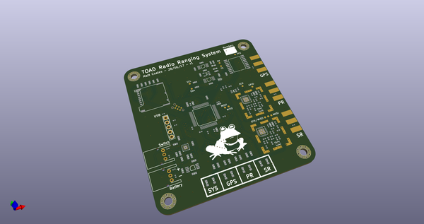
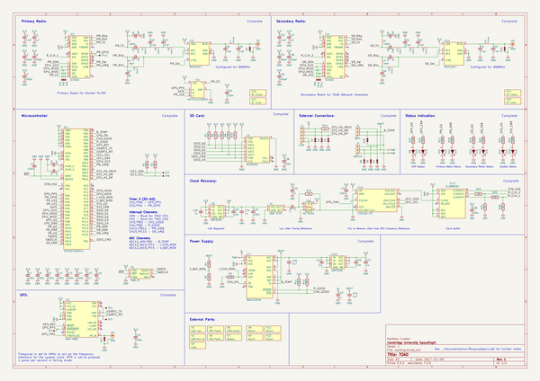
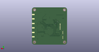
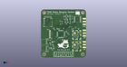

# OOMP Project  
## m3-avionics  by adamgreig  
  
(snippet of original readme)  
  
- Martlet III Avionics  
  
This repository contains all the avionics for Martlet 3, including system   
design, documentation, schematics, PCBs, and firmware.  
  
  full source readme at [readme_src.md](readme_src.md)  
  
source repo at: [https://github.com/adamgreig/m3-avionics](https://github.com/adamgreig/m3-avionics)  
## Board  
  
  
## Schematic  
  
  
  
[schematic pdf](working_schematic.pdf)  
## Images  
  
  
  
  
  
  
