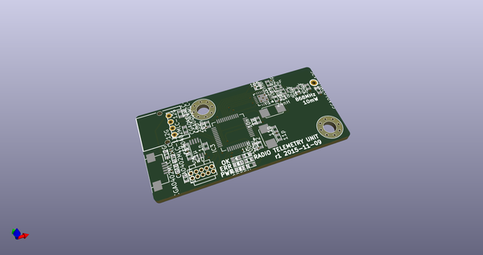
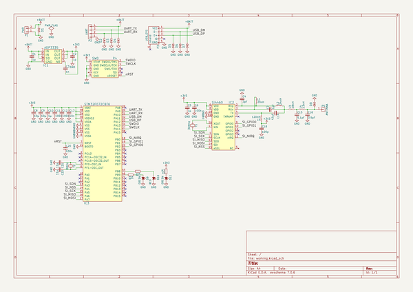
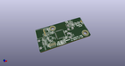
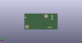
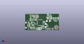

# OOMP Project  
## radtel  by adamgreig  
  
oomp key: oomp_projects_flat_adamgreig_radtel  
(snippet of original readme)  
  
- RadTel  
  
This is a simple radio telemetry module using an STM32F0 microcontroller and an   
Si4460 radio transceiver. The board is designed to be used as part of a KiCAD   
tutorial workshop demonstrating basic circuit design, schematic capture, and   
PCB layout.  
  
  full source readme at [readme_src.md](readme_src.md)  
  
source repo at: [https://github.com/adamgreig/radtel](https://github.com/adamgreig/radtel)  
## Board  
  
  
## Schematic  
  
  
  
[schematic pdf](working_schematic.pdf)  
## Images  
  
  
  
  
  
  
