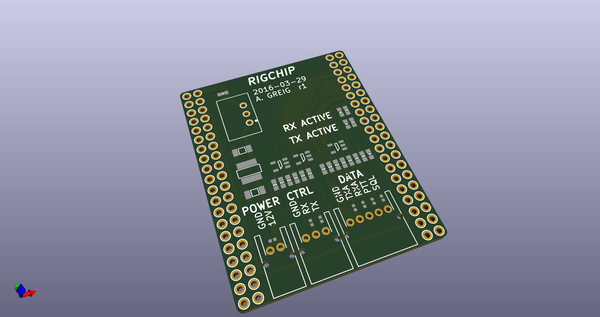
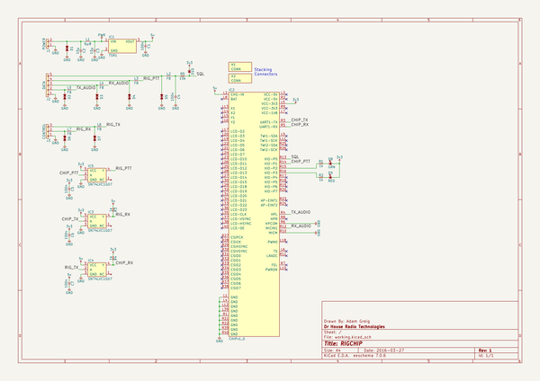
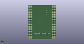
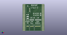

# OOMP Project  
## rigchip  by adamgreig  
  
oomp key: oomp_projects_flat_adamgreig_rigchip  
(snippet of original readme)  
  
- rigchip  
  
connects your CHIP to your RIG  
  
runs off rig 12V, audio in/out, serial in/out, PTT/SQL in/out  
  
  
  
  
  full source readme at [readme_src.md](readme_src.md)  
  
source repo at: [https://github.com/adamgreig/rigchip](https://github.com/adamgreig/rigchip)  
## Board  
  
  
## Schematic  
  
  
  
[schematic pdf](working_schematic.pdf)  
## Images  
  
  
  
  
  
  
