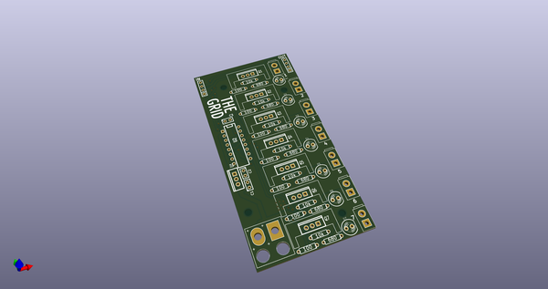
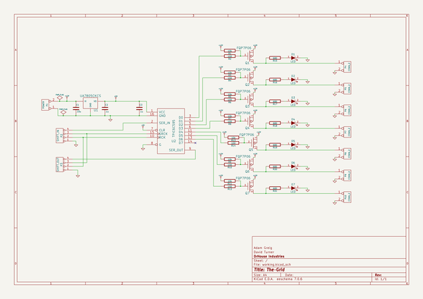
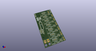
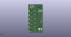
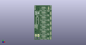

# OOMP Project  
## thegrid  by adamgreig  
  
oomp key: oomp_projects_flat_adamgreig_thegrid  
(snippet of original readme)  
  
- The·Grid  
  
The·Grid is an installation at [EMF](https://emfcamp.org) 2014 and 2016. This   
repository contains the hardware, firmware, software, and miscellaneous   
documentation and scripts that go with it.  
  
-- Hardware  
All the PCB designs live in the `hardware/` folder. They're done in KiCAD.  
  
-- Firmware  
The firmware that runs on the pole PCBs (new in 2016), which controls the RGB   
LED and buzzer and reads data from the serial bus, lives in `firmware/polefw`.  
  
The firmware that runs on the driver PCB, which is basically a glorified USB to   
RS422 serial widget, lives in `firmware/driverfw`.  
  
Both use ChibiOS (16.1) so you should `git submodule update --init` to get that   
checked out. Additionally you'll want to patch a bug in ChibiOS, see the README   
in `firmware/` for more details.  
  
-- Software  
The software runs code-defined patterns of light and sound on The·Grid itself.   
It's written in Python 3, using asyncio, with some WebGL for an in-browser   
simulation.  
  
It's fairly easy to add your own patterns, please see the README in `software/`   
for more details.  
  
  full source readme at [readme_src.md](readme_src.md)  
  
source repo at: [https://github.com/adamgreig/thegrid](https://github.com/adamgreig/thegrid)  
## Board  
  
  
## Schematic  
  
  
  
[schematic pdf](working_schematic.pdf)  
## Images  
  
  
  
  
  
  
