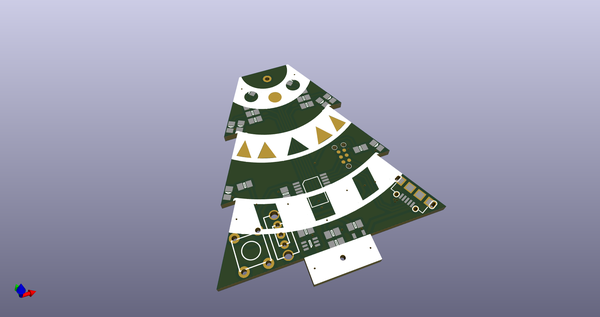
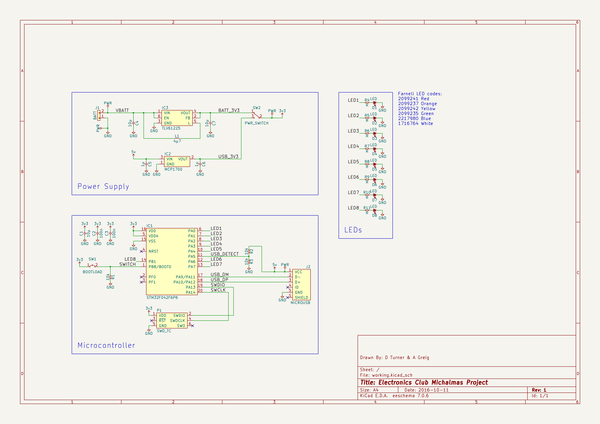
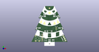

# OOMP Project  
## yuletronics  by adamgreig  
  
oomp key: oomp_projects_flat_adamgreig_yuletronics  
(snippet of original readme)  
  
- Yuletronics: Electronics Club Project Michaelmas 2016  
  
This repository contains the example Yuletronics project for Electronics Club.   
You can either use git to clone it, or simply download it   
[here](https://github.com/adamgreig/yuletronics/archive/master.zip).  
  
You'll need KiCAD to open and edit the PCB: [download it   
here](http://kicad.org/). If you can easily get a nightly build, they have   
a few nice new features.  
  
  
  
  full source readme at [readme_src.md](readme_src.md)  
  
source repo at: [https://github.com/adamgreig/yuletronics](https://github.com/adamgreig/yuletronics)  
## Board  
  
  
## Schematic  
  
  
  
[schematic pdf](working_schematic.pdf)  
## Images  
  
  
  
  
  
  
