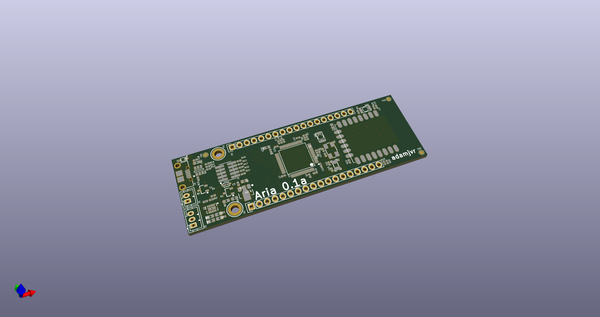
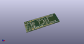
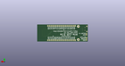
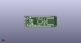

# OOMP Project  
## Aria  by adamjvr  
  
oomp key: oomp_projects_flat_adamjvr_aria  
(snippet of original readme)  
  
- Aria  
ARM Cortex M4F + WiFi + MPPT Solar Battery Powered module, mBed and Arduino Compatible hardware development platform.  
- ARM Cortex M4F 180MHZ STM32F446RET6  
- ESP8285 WiFi SoC w/ PCB Antenna  
- WiFi  
- USB 2.0 Connectivity  
- Plenty or GPIO/Serial via the STM32  
- Over the air programming and updating  
- Lithium Ion Battery Power  
- MPPT Solar battery charging  
- USB bus power for desktop development  
- Over the Air Programming  
- Low power  
- 2 Year Battery Life w/Single Cell Lithium Battery  
  
  
Aria 0.1a PCB  
  
Aria 0.1a 3D Render of PCB  
Top  
  
Bottom  
  
Aria 0.1a ESP-12E Version PCB  
  
  
  full source readme at [readme_src.md](readme_src.md)  
  
source repo at: [https://github.com/adamjvr/Aria](https://github.com/adamjvr/Aria)  
## Board  
  
  
## Schematic  
  
  
  
[schematic pdf](working_schematic.pdf)  
## Images  
  
  
  
  
  
  
