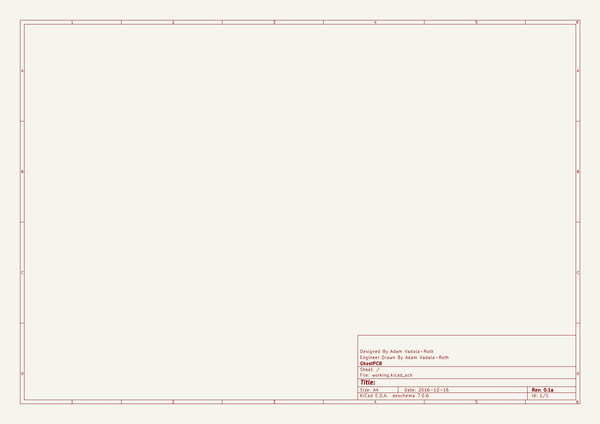

# OOMP Project  
## Beaglebone-Pink  by adamjvr  
  
oomp key: oomp_projects_flat_adamjvr_beaglebone_pink  
(snippet of original readme)  
  
- Beaglebone-Pink  
The Beaglebone Pink based on the Otavo System OSD3358 is a Sub 1GHZ  
Solar/Battery Powered Beaglebone Wireless variant.The target application is  
low power highly remote deployment of a Beaglbeone based Linux System.Building  
on the SunLeaf and S1G-Mod hardware projects and HydroPWNics ecosystem.  
  
Specs:  
- Octavo Systems OSD3358 Beaglebone System In Package  
- ADI ADF7023 900MHZ Radio Transceiver  
- USB Micro power/FTDI serial  
- Solar MPPT Lithium Battery Charger  
- Battery Monitoring and Safety controller  
- SeeedStudio I2C Grove Port  
- SeeedStudio UART Grove Port  
  
  full source readme at [readme_src.md](readme_src.md)  
  
source repo at: [https://github.com/adamjvr/Beaglebone-Pink](https://github.com/adamjvr/Beaglebone-Pink)  
## Board  
  
  
## Schematic  
  
  
  
[schematic pdf](working_schematic.pdf)  
## Images  
  
  
  
  
  
  
