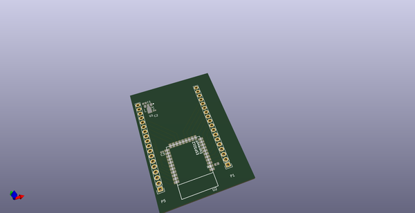
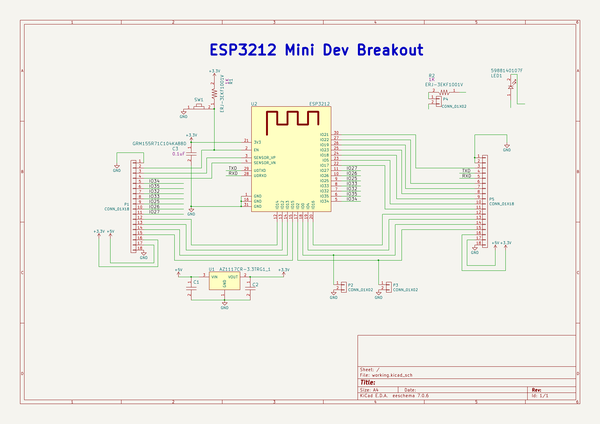
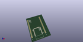
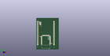

# OOMP Project  
## ESP3212-breakout  by adamjvr  
  
(snippet of original readme)  
  
- ESP3212-breakout  
simple breakout for the ESP3212 modules, include 3V3 LDO, and pin headers female/male with breadboard spacing  
  
  full source readme at [readme_src.md](readme_src.md)  
  
source repo at: [https://github.com/adamjvr/ESP3212-breakout](https://github.com/adamjvr/ESP3212-breakout)  
## Board  
  
  
## Schematic  
  
  
  
[schematic pdf](working_schematic.pdf)  
## Images  
  
  
  
  
  
  
