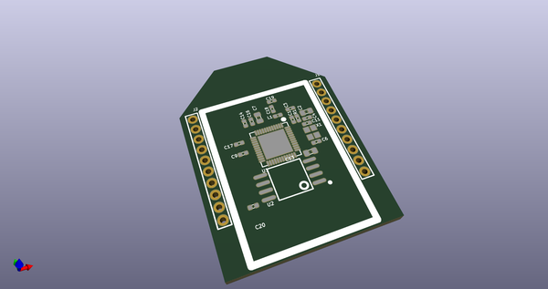
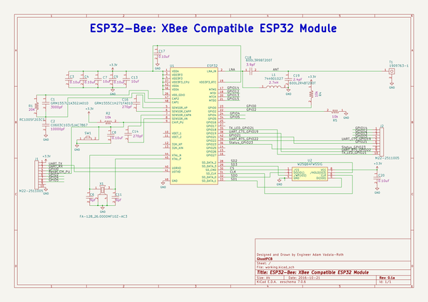
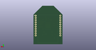
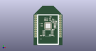

# OOMP Project  
## ESP32Bee  by adamjvr  
  
oomp key: oomp_projects_flat_adamjvr_esp32bee  
(snippet of original readme)  
  
- ESP32Bee  
An ESP32 module in the XBee Formfactor  
- XBee 2mm pitch headers, same pinout slightly modified  
- ESP32 WiFi/BLE Dual Core Microcontroll/SoC  
- UM Antenna Connector for external 2.4GHZ Antennas  
- Open Source Hardware under CERN License  
- Designed In KiCAD  
  
  full source readme at [readme_src.md](readme_src.md)  
  
source repo at: [https://github.com/adamjvr/ESP32Bee](https://github.com/adamjvr/ESP32Bee)  
## Board  
  
  
## Schematic  
  
  
  
[schematic pdf](working_schematic.pdf)  
## Images  
  
  
  
  
  
  
