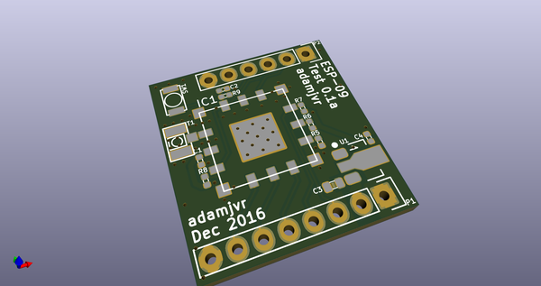
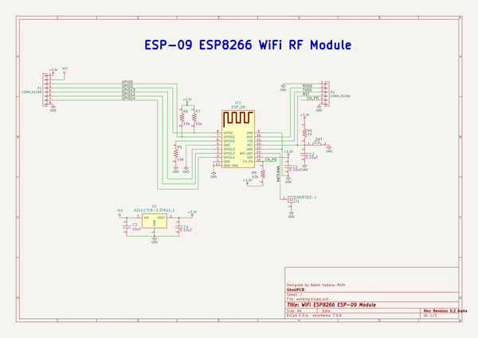
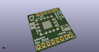
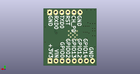
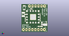

# OOMP Project  
## ESP-09-Test  by adamjvr  
  
oomp key: oomp_projects_flat_adamjvr_esp_09_test  
(snippet of original readme)  
  
- ESP-09-Test  
A simple quick breakout board to test the functionality of the ESP-09 ESP8266 module. Designed to test the modules functionality in comparison to the ESP-12E module used in the SunLEaf prototypes and the version 1 PCB that was modified.  
  
KiCAD 3D Renders  
  
  
  
  
OSHPark Board Renders  
  
Top  
  
  
  
Bottom  
  
  
  
  full source readme at [readme_src.md](readme_src.md)  
  
source repo at: [https://github.com/adamjvr/ESP-09-Test](https://github.com/adamjvr/ESP-09-Test)  
## Board  
  
  
## Schematic  
  
  
  
[schematic pdf](working_schematic.pdf)  
## Images  
  
  
  
  
  
  
