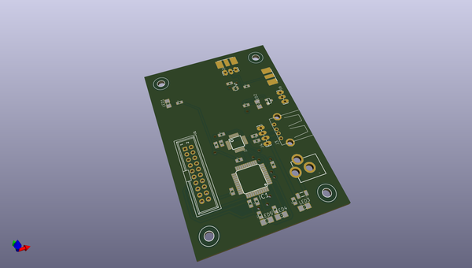
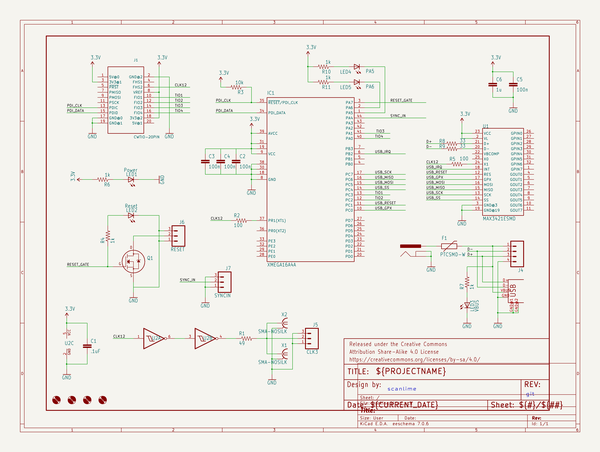

# OOMP Project  
## facewhisperer  by adamjvr  
  
(snippet of original readme)  
  
FaceWhisperer  
=============  
  
FaceWhisperer is a hardware add-on for the [ChipWhisperer](https://newae.com/tools/chipwhisperer/) side-channel analysis tool, for working with devices that primarily communicate over USB. The goal is to create a USB host controller scripted with an experiment, all running totally synchronous with the target. This should give predictable timing each time the experiment is run from a target reset.  
  
One proven use for this is to glitch GET_DESCRIPTOR requests into returning firmware images for devices that don't otherwise have firmware available for inspection.  
  
The experiments are scripted from an ATxmega128 processor, same as the one included on ChipWhisperer-Lite. The USB host is a MAX3241E, inspired by Travis Goodspeed's [Facedancer21](http://goodfet.sourceforge.net/hardware/facedancer21/) tool.  
  
For keeping the target device in sync, this board provides a 12 MHz clock output, an open-collector reset output, and a trigger input with adjustable voltage threshold.  
  
This project is a quick hack that builds on the work and inspiration of several great projects:  
  
- [GoodFET](http://goodfet.sourceforge.net)  
- [ChipWhisperer](https://newae.com/tools/chipwhisperer)  
- [Xmegaduino](https://github.com/Xmegaduino/Xmegaduino)  
- [Arduino USB Host Shield library](https://github.com/felis/USB_Host_Shield_2.0)  
  
This repository includes the hardware design itself, as well as a firmware framework and scripts to integrate with ChipWhisperer.  
  
<img alt="Prototype PC  
  full source readme at [readme_src.md](readme_src.md)  
  
source repo at: [https://github.com/adamjvr/facewhisperer](https://github.com/adamjvr/facewhisperer)  
## Board  
  
  
## Schematic  
  
  
  
[schematic pdf](working_schematic.pdf)  
## Images  
