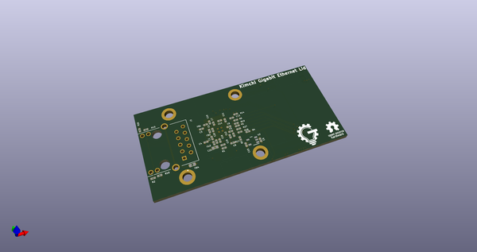
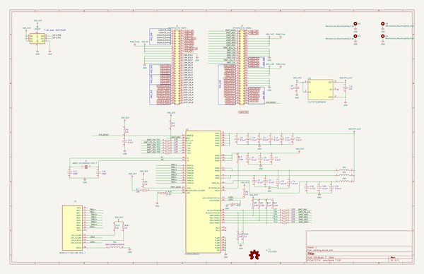
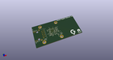
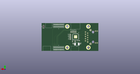
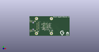

# OOMP Project  
## kimchi-ethernet-lid  by adamjvr  
  
(snippet of original readme)  
  
- kimchi-ethernet-lid  
A simple lid for the GroupGets Kimchi Miro SBC that adds gigabit Ethernet in a compact package  
  
  full source readme at [readme_src.md](readme_src.md)  
  
source repo at: [https://github.com/adamjvr/kimchi-ethernet-lid](https://github.com/adamjvr/kimchi-ethernet-lid)  
## Board  
  
  
## Schematic  
  
  
  
[schematic pdf](working_schematic.pdf)  
## Images  
  
  
  
  
  
  
