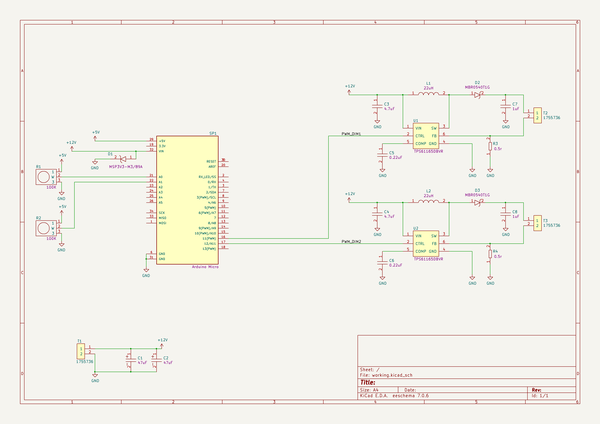
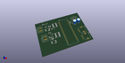
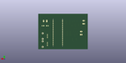
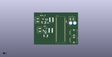

# OOMP Project  
## LED-board-MW  by adamjvr  
  
oomp key: oomp_projects_flat_adamjvr_led_board_mw  
(snippet of original readme)  
  
- LED-board-MW  
A little LED board to help out a friend  
  
  full source readme at [readme_src.md](readme_src.md)  
  
source repo at: [https://github.com/adamjvr/LED-board-MW](https://github.com/adamjvr/LED-board-MW)  
## Board  
  
  
## Schematic  
  
  
  
[schematic pdf](working_schematic.pdf)  
## Images  
  
  
  
  
  
  
