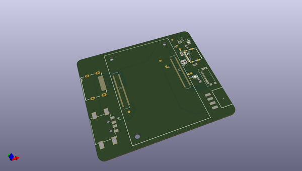
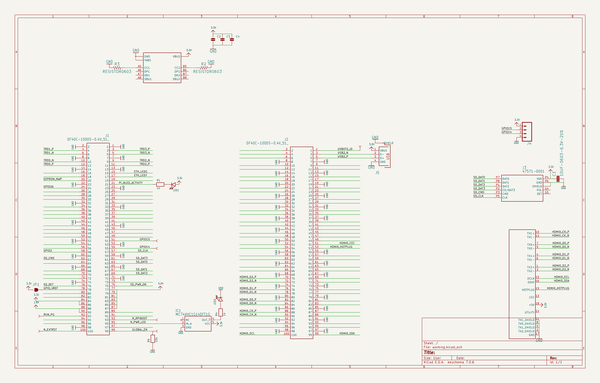

# OOMP Project  
## Minimal-RPi-CM-4-Carrier  by adamjvr  
  
oomp key: oomp_projects_flat_adamjvr_minimal_rpi_cm_4_carrier  
(snippet of original readme)  
  
Some photos can be found here: https://hackaday.io/project/175832-minimal-raspberry-pi-cm-4-carrier  
  
Why  
------  
The goal was to show how little you have to do to do a fairly feature rich carrier board for the Compute Module 4. Also to demonstrate that you don't have to be scared by high-speed signals like HDMI and that they can still work fine in very bad conditions like a single layer PCB like this one without a reference plane underneath.  
  
Please only use this as a starting point if at all and take a look at the open reference design by the Pi foundation for a more in-depth carrier design. This design skips several saftey features like load switches on the USB and HDMI, most of the time that's fine but you should make sure that you really don't care about that.  
  
Please do not see this as best pracitize what so ever when it comes to routing. This PCB was made for milling a CNC and thus a lot of very bad trade offs were made that you can completely avoid by using a normal PCB fab.  
  
Also do please attempt to do some impedance matching. An online calculator to get the correct trace width is already an ok approximation for most hobby use cases. JLC f.e. has their own calculator tuned to their specific stackups: https://cart.jlcpcb.com/impedanceCalculation  
  
4 Layer PCBs are to be had for 5$ and less now a days so I really suggest using 4 layers, no matter what you plan.  
  
The PCB is done in Eagle, if you use KiCad I suggest just using the schematic as a starting point and use the   
  full source readme at [readme_src.md](readme_src.md)  
  
source repo at: [https://github.com/adamjvr/Minimal-RPi-CM-4-Carrier](https://github.com/adamjvr/Minimal-RPi-CM-4-Carrier)  
## Board  
  
  
## Schematic  
  
  
  
[schematic pdf](working_schematic.pdf)  
## Images  
