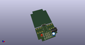
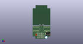

# OOMP Project  
## PedalFX2  by adamjvr  
  
(snippet of original readme)  
  
- PedalFX2  
New version of PedalFX for 1590 enclosures   
  
Special thanks and credit goes to Caravan ElectroWorks for the original design and inspiring to make my own version that integrates DC barrel jack power.  
http://www.caravanelectroworks.com/?p=418  
  
  full source readme at [readme_src.md](readme_src.md)  
  
source repo at: [https://github.com/adamjvr/PedalFX2](https://github.com/adamjvr/PedalFX2)  
## Board  
  
  
## Schematic  
  
  
  
[schematic pdf](working_schematic.pdf)  
## Images  
  
  
  
  
  
  
