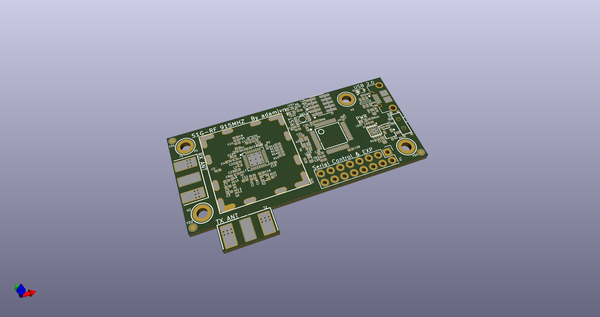
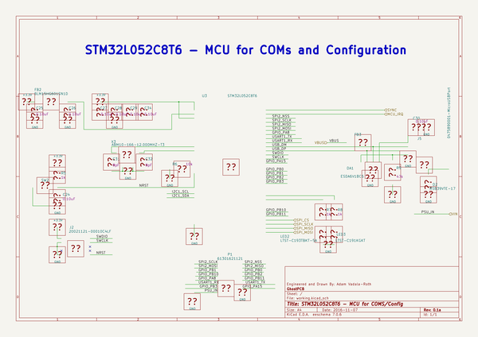
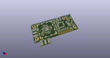
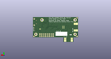
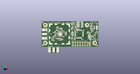

# OOMP Project  
## S1G-Mod  by adamjvr  
  
oomp key: oomp_projects_flat_adamjvr_s1g_mod  
(snippet of original readme)  
  
- S1G-Mod  
A Sub 1GHZ Wireless Module for various Sub 1GHZ projects and applications  
Hardware Specs  
- ADF7023 RF Transceiver  
- 28 Mile line of site range  
- Dedicated Antennas for RX and TX  
- Open Source under CERN Open Hardware License v1.2 (Included)  
- Circuitry shielded with outer shield.  
- UM Coaxial Antenna connectors  
- STM32L052C8T6 ARM Cortex M0+  
- USB 2.0 connectivity  
- USART connectivity  
- SPI connectivity  
- USB bus or battery powered  
- Combined and Separate PA/LNA Match versions of 915MHZ and 433MHZ modules  
  
Firmware and development at:  
https://github.com/adamjvr/S1G-RF-firmwware  
  
Combined RX/TX S1G-RF Module:  
  
KiCAD 3D OpenGL  
  
  
Separate RX/TX S1G-RF Module:  
  
KiCAD 3D OpenGL  
  
  
Adapters:  
  
USART JST Adapter  
  
SPI JST Adapter  
  
  
Adapter Test Fit:  
  
  
  full source readme at [readme_src.md](readme_src.md)  
  
source repo at: [https://github.com/adamjvr/S1G-Mod](https://github.com/adamjvr/S1G-Mod)  
## Board  
  
  
## Schematic  
  
  
  
[schematic pdf](working_schematic.pdf)  
## Images  
  
  
  
  
  
  
